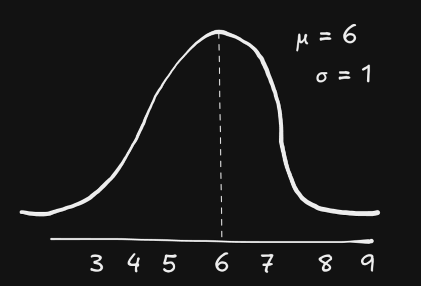
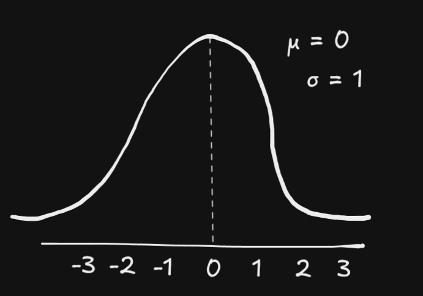
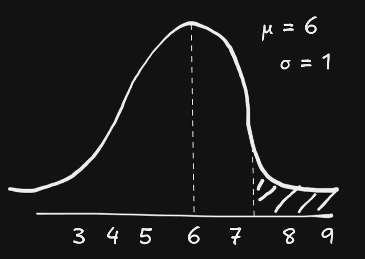
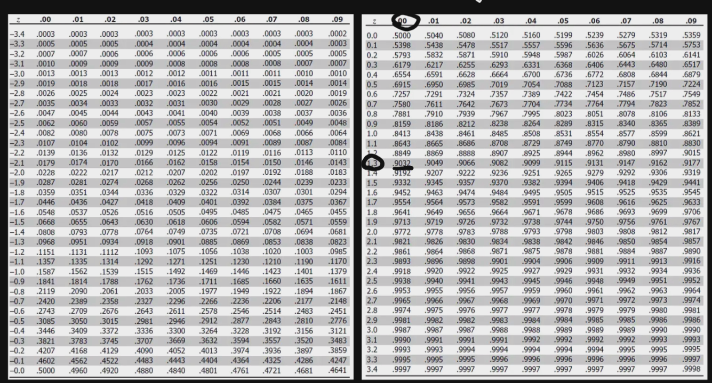

# Basic Concepts of Statistics

Statistics is the discipline of collecting, analyzing, and interpreting data. It is broadly divided into:

- **Descriptive Statistics**: Summarizing and describing data.
- **Inferential Statistics**: Drawing conclusions about a population based on sample data.

We will use the following dataset for examples:

| Observation | Value ($x$) |
|-------------|-------------|
| 1           | 5           |
| 2           | 8           |
| 3           | 7           |
| 4           | 10          |
| 5           | 6           |

### Population and Samples
- **Population**: The entire group of individuals or items of interest. For example, all students in a school.
- **Sample**: A subset of the population used to make inferences about the whole. For example, 50 students selected from the school.

### Sampling Techniques
- **Random Sampling**: Every member of the population has an equal chance of being selected.
- **Stratified Sampling**: The population is divided into subgroups (strata), and random samples are taken from each.
- **Systematic Sampling**: Every $k^{th}$ member of the population is selected.
- **Convenience Sampling**: Samples are taken based on ease of access.

### Variables
- **Definition**: A variable is a characteristic or attribute that can take different values.
  - **Independent Variable**: The variable that is manipulated or categorized.
  - **Dependent Variable**: The variable that is measured or observed.

### Variable Measurement Scales
1. **Nominal**: Categories without a natural order (e.g., colors, gender).
2. **Ordinal**: Categories with a natural order (e.g., rankings).
3. **Interval**: Numerical data without a true zero (e.g., temperature in Celsius).
4. **Ratio**: Numerical data with a true zero (e.g., weight, height).

### Percentiles and Quantiles
- **Percentiles**: A measure that indicates the value below which a given percentage of observations fall.
  - Formula: If the dataset is sorted in ascending order, the $k^{th}$ percentile is the value at position:
    $$ P_k = \frac{k}{100} \cdot (n + 1) $$
    where $n$ is the number of data points. The $n + 1$ ensures interpolation between data points for continuous percentiles. 
    When calculating percentiles or quantiles, the idea is to find a position in the dataset that corresponds to a specific percentage of the data.
    If you simply use $n$, the formula works for discrete datasets but may underestimate the percentile position for continuous or interpolated datasets. 
    Adding $1$ accounts for the gap between data points when imagining the dataset as a continuum. 
    It essentially extends the range to allow for interpolation between actual data points.

  - Example: In the dataset $[5, 6, 7, 8, 10]$:
    - The $25^{th}$ percentile ($P_{25}$) lies at position:
      $$ P_{25} = \frac{25}{100} \cdot (5 + 1) = 1.5 $$
      Interpolating between the $1^{st}$ and $2^{nd}$ values: $\frac{5 + 6}{2} = 5.5$

- **Quantiles**: Points that divide the data into equal-sized intervals.
  - Quartiles divide data into four intervals:
    - $Q_1$ (25th percentile), $Q_2$ (50th percentile or median), $Q_3$ (75th percentile).
  - Deciles divide data into ten intervals.
  - Percentiles divide data into 100 intervals.
  - Example:
    - $Q_1$ is $5.5$
    - $Q_2$ (median) is $7$
    - $Q_3$ is $8.5$

### Outliers
- **Outlier**: A data point that differs significantly from others.
  - Using the interquartile range (IQR) - Tukey's method:
    - Lower Bound = $Q_1 - 1.5 \cdot \text{IQR}$
    - Upper Bound = $Q_3 + 1.5 \cdot \text{IQR}$
    - Any value outside these bounds is considered an outlier.

### Measures of Central Tendency
- **Mean**: The average value.
  $$ \text{Mean} = \frac{\sum x}{n} = \frac{5 + 8 + 7 + 10 + 6}{5} = \frac{36}{5} = 7.2 $$

- **Median**: The middle value when data is sorted.
  Sorted data: $[5, 6, 7, 8, 10]$
  Median = $7$

- **Mode**: The most frequent value. In this dataset, no value repeats.
  $$ \text{Mode} = \text{None} $$

### Measures of Dispersion
- **Range**: Difference between the largest and smallest values.
  $$ \text{Range} = x_{\text{max}} - x_{\text{min}} = 10 - 5 = 5 $$

- **Variance**: Measures the average squared deviation of each data point from the mean. It quantifies how spread out the data is. 
  $$ \text{Variance} = \sigma^2 = \frac{\sum (x_i - \mu)^2}{n} $$
  $$ \sigma^2 = \frac{(5 - 7.2)^2 + (8 - 7.2)^2 + (7 - 7.2)^2 + (10 - 7.2)^2 + (6 - 7.2)^2}{5} $$
  $$ \sigma^2 = \frac{4.84 + 0.64 + 0.04 + 7.84 + 1.44}{5} = \frac{14.8}{5} = 2.96 $$

- **Standard Deviation**: Square root of the variance. It represents the average distance of each data point from the mean. 
  $$ \sigma = \sqrt{\text{Variance}} = \sqrt{2.96} \approx 1.72 $$

- **Interquartile Range (IQR)**: Spread of the middle 50% of data.
  - First quartile ($Q_1$): Median of the lower half: $6$
  - Third quartile ($Q_3$): Median of the upper half: $8$
  $$ \text{IQR} = Q_3 - Q_1 = 8 - 6 = 2 $$

### Probability Density Function (PDF) and Probability Mass Function (PMF)

---

- **Probability Density Function (PDF)**: Describes the likelihood of a continuous random variable taking on a specific value. Since the data is continuous, probabilities are represented as areas under the curve of the PDF.

  - **Key Properties**:
    1. The PDF is always non-negative: $f(x) \geq 0$.
    2. The total area under the curve equals 1:
       $$ \int_{-\infty}^{\infty} f(x) \, dx = 1 $$

- **Probability Mass Function (PMF)**: Describes the probabilities for discrete random variables, assigning probabilities to exact values.

  - **Key Properties**:
    1. The PMF is always non-negative: $P(X = x) \geq 0$.
    2. The sum of probabilities for all possible values equals 1:
       $$ \sum_{x} P(X = x) = 1 $$

### Common Probability Distributions

#### 1. Gaussian (Normal) Distribution
- **Definition**: A continuous probability distribution characterized by its bell-shaped curve.
- **PDF**:
  $$ f(x) = \frac{1}{\sqrt{2\pi \sigma^2}} e^{-\frac{(x - \mu)^2}{2\sigma^2}} $$
  Where:
  - $\mu$ is the mean (center of the distribution).
  - $\sigma$ is the standard deviation (spread of the distribution).

#### Z-score
The Z-score tells you how many standard deviations a value $X$ is away from the mean $\mu$.

$$ Z = \frac{X - \mu}{\sigma} $$

Where:
- $X$ is the value you're examining,
- $\mu$ is the mean of the distribution,
- $\sigma$ is the standard deviation of the distribution.

  

Where does the value $x=7.2$ fall in terms of standard deviations from the mean?

$$
Z = \frac{7.2 - 6}{1} = 1.2 sd
$$

#### Standart Normal Distribution

The standard normal distribution, also called the z-distribution, is a special normal distribution where the mean is 0 and the standard deviation is 1.

Lets apply Z-score to every value:

$$
Z(3) = \frac{3 - 6}{1} = -3
$$

$$
Z(4) = \frac{4 - 6}{1} = -2
$$

$$
Z(5) = \frac{5 - 6}{1} = -1
$$

$$
Z(6) = \frac{6 - 6}{1} = 0
$$

$$
Z(7) = \frac{7 - 6}{1} = 1
$$

$$
Z(8) = \frac{8 - 6}{1} = 2
$$

$$
Z(9) = \frac{9 - 6}{1} = 3
$$

  

This process called standartization.

#### Normalization

Normalization is the process of adjusting the values of numerical data to a common scale, without distorting differences in the ranges of values.

##### Min-Max Normalization

Min-Max normalization rescales the data into a specific range, typically [0, 1]. This technique is especially useful when you need the data to fit within a bounded interval. It is calculated by subtracting the minimum value from each data point and then dividing by the range of the data.

$$
X_{\text{norm}} = \frac{X - X_{\text{min}}}{X_{\text{max}} - X_{\text{min}}}
$$

##### Robust Scaling

Robust Scaling is a normalization method that scales the data using statistics that are robust to outliers, such as the median and the interquartile range (IQR). This method is useful when you have data with many outliers that might affect other scaling techniques like Min-Max normalization.

$$
X_{\text{robust}} = \frac{X - \text{Median}}{\text{IQR}}
$$

Where:
- Median is the middle value of the dataset,
- IQR is the interquartile range ($Q_3 - Q_1$).

This method ensures that the data is scaled based on the central tendency and spread of the data, making it more resilient to outliers.

### Z-table
In statistics, a standard normal table, also called the unit normal table or Z table, is a mathematical table for the values of $\phi$, the cumulative distribution function of the normal distribution. It is used to find the probability that a statistic is observed below, above, or between values on the standard normal distribution, and by extension, any normal distribution. Since probability tables cannot be printed for every normal distribution, as there are an infinite variety of normal distributions, it is common practice to convert a normal to a standard normal (known as a z-score) and then use the standard normal table to find probabilities.

  

##### What percentage of scores falls above 7.3?

$$
Z(7.3) = \frac{7.3 - 6}{1} = 1.3
$$

  

From z-table 

$$
P(Z \le1.3) = 0.9032
$$

$$
P(Z > 1.3) = 1 - 0.9032 =0.0968
$$

## References

https://www.youtube.com/watch?v=LZzq1zSL1bs

https://en.wikipedia.org/wiki/Standard_normal_table

https://www.youtube.com/watch?v=xbDnT3NqEIs

