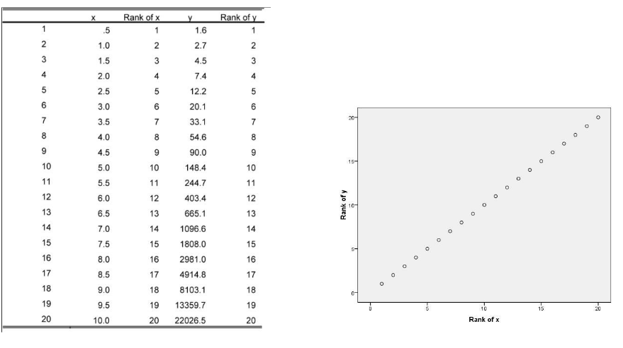

# Basic Concepts of Statistics

Statistics is the discipline of collecting, analyzing, and interpreting data. It is broadly divided into:

- Descriptive Statistics: Summarizing and describing data.
- Inferential Statistics: Drawing conclusions about a population based on sample data.

We will use the following dataset for examples:

| Observation | Value ($x$) |
|-------------|-------------|
| 1           | 5           |
| 2           | 8           |
| 3           | 7           |
| 4           | 10          |
| 5           | 6           |

### Population and Samples
- Population: The entire group of individuals or items of interest. For example, all students in a school.
- Sample: A subset of the population used to make inferences about the whole. For example, 50 students selected from the school.

### Sampling Techniques
- Random Sampling: Every member of the population has an equal chance of being selected.
- Stratified Sampling: The population is divided into subgroups (strata), and random samples are taken from each.
- Systematic Sampling: Every $k^{th}$ member of the population is selected.
- Convenience Sampling: Samples are taken based on ease of access.

### Variables
- Definition: A variable is a characteristic or attribute that can take different values.
  - Independent Variable: The variable that is manipulated or categorized.
  - Dependent Variable: The variable that is measured or observed.

### Variable Measurement Scales
1. Nominal: Categories without a natural order (e.g., colors, gender).
2. Ordinal: Categories with a natural order (e.g., rankings).
3. Interval: Numerical data without a true zero (e.g., temperature in Celsius).
4. Ratio: Numerical data with a true zero (e.g., weight, height).

### Percentiles and Quantiles
- Percentiles: A measure that indicates the value below which a given percentage of observations fall.
  - Formula: If the dataset is sorted in ascending order, the $k^{th}$ percentile is the value at position:

$$ P_k = \frac{k}{100} \cdot (n + 1) $$

  where $n$ is the number of data points. The $n + 1$ ensures interpolation between data points for continuous percentiles. When calculating percentiles or quantiles, the idea is to find a position in the dataset that corresponds to a specific percentage of the data. If you simply use $n$, the formula works for discrete datasets but may underestimate the percentile position for continuous or interpolated datasets. Adding $1$ accounts for the gap between data points when imagining the dataset as a continuum. It essentially extends the range to allow for interpolation between actual data points.

  - Example: In the dataset $[5, 6, 7, 8, 10]$:
    - The $25^{th}$ percentile ($P_{25}$) lies at position:

$$ P_{25} = \frac{25}{100} \cdot (5 + 1) = 1.5 $$
    
  Interpolating between the $1^{st}$ and $2^{nd}$ values: $\frac{5 + 6}{2} = 5.5$

- Quantiles: Points that divide the data into equal-sized intervals.
  - Quartiles divide data into four intervals:
    - $Q_1$ (25th percentile), $Q_2$ (50th percentile or median), $Q_3$ (75th percentile).
  - Deciles divide data into ten intervals.
  - Percentiles divide data into 100 intervals.
  - Example:
    - $Q_1$ is $5.5$
    - $Q_2$ (median) is $7$
    - $Q_3$ is $8.5$

### Outliers
- Outlier: A data point that differs significantly from others.
  - Using the interquartile range (IQR) - Tukey's method:
    - Lower Bound = $Q_1 - 1.5 \cdot \text{IQR}$
    - Upper Bound = $Q_3 + 1.5 \cdot \text{IQR}$
    - Any value outside these bounds is considered an outlier.

### Measures of Central Tendency
- Mean: The average value.
  - Population Mean
  
$$\mu = \frac{\sum X}{N}$$

  - Sample Mean

$$\overline{X} = \frac{\sum X}{n}$$

- Median: The middle value when data is sorted.
  Sorted data: $[5, 6, 7, 8, 10]$
  Median = $7$

- Mode: The most frequent value. In this dataset, no value repeats.

$$ \text{Mode} = \text{None} $$

### Measures of Dispersion
- Range: Difference between the largest and smallest values.

$$ \text{Range} = x_{\text{max}} - x_{\text{min}} = 10 - 5 = 5 $$

- Variance: Measures the average squared deviation of each data point from the mean. It quantifies how spread out the data is. 

  - Population Variance

$$ \sigma^2 = \frac{\sum (x_i - \mu)^2}{N} $$
  
  - Sample variance (unbiased)

$$ S^2 = \frac{\sum (x_i - \overline{X})^2}{n - 1}$$

  ##### Bessel's correction

  In order to understand why $n - 1$ is used, we need to revisit what variance actually represents. Variance quantifies how spread out the data is. For sample variance, we calculate how spread out the data is from the sample mean ($\overline{X}$). However, samples cannot perfectly represent the population, and since we don't know the population mean ($\mu$), we also don't know the population variance. Therefore, we need to estimate it.

  (I spent too much time on this. I added some additional links to the resources. There are proofs, intuitive explanations with graphs, formal proofs, and so on, but some of them are not very convincing. I'll note this down briefly here just as a recall for later, so this section might not work for you.)

  Sample variance tends to underestimate the population variance on average. This is due to how samples are typically selected. Since variance is just a measurement of how spread out the data is, and since we calculate the sample variance using the sample mean, in order to overestimate the variance in general, we would need to choose more samples from the overestimated region (blue) than from the other region (red). I say "in general" because, of course, you can select specific samples to overestimate the population variance but it generally tends to underestimate the population variance on average.

  

    
  

  Why n - 1? We know that when you have a sample and estimate the mean, you have n – 1 degrees of freedom, where n is the sample size (degrees of freedom). For calculating $\overline{X}$, there are only n - 1 free variables that you can set freely, as the last value has to be chosen to satisfy the equation.
 

  Estimating Bias: $S_n^2 = \sigma^2 - Bias$
  
  if n = 1 $X = \overline{X}$ so $S_n^2 = 0$ therefore $Bias = \sigma^2$
  
  if n = 2 on avarage $Bias = \frac{\sigma^2}{2}$

  $Avarage\ Bias = \frac{\sigma^2}{n}$

  $S_n^2 = \frac{\sigma^2}{n}$ so $S_n^2(\frac{n}{n - 1}) = \sigma^2$

  $\frac{\sum (X-\overline{X})^2}{n}(\frac{n}{n-1}) =\sigma^2$ -Not always true obsiously but generally-

- Standard Deviation: Square root of the variance. It represents the average distance of each data point from the mean. 
  
$$ \sigma = \sqrt{\text{Variance}}$$

- Interquartile Range (IQR): Spread of the middle 50% of data.
  - First quartile ($Q_1$): Median of the lower half: $6$
  - Third quartile ($Q_3$): Median of the upper half: $8$

$$ \text{IQR} = Q_3 - Q_1 = 8 - 6 = 2 $$

### Probability Density Function (PDF) and Probability Mass Function (PMF)

---

- Probability Density Function (PDF): Describes the likelihood of a continuous random variable taking on a specific value. Since the data is continuous, probabilities are represented as areas under the curve of the PDF.

  - Key Properties:
    1. The PDF is always non-negative: $f(x) \geq 0$.
    2. The total area under the curve equals 1:
       
$$ \int_{-\infty}^{\infty} f(x) \, dx = 1 $$

- Probability Mass Function (PMF): Describes the probabilities for discrete random variables, assigning probabilities to exact values.

  - Key Properties:
    1. The PMF is always non-negative: $P(X = x) \geq 0$.
    2. The sum of probabilities for all possible values equals 1:
       
$$ \sum_{x} P(X = x) = 1 $$

### Gaussian (Normal) Distribution
- Definition: A continuous probability distribution characterized by its bell-shaped curve.
- PDF:
  
$$ f(x) = \frac{1}{\sqrt{2\pi \sigma^2}} e^{-\frac{(x - \mu)^2}{2\sigma^2}} $$

Where:
  - $\mu$ is the mean (center of the distribution).
  - $\sigma$ is the standard deviation (spread of the distribution).

### Z-score
The Z-score tells you how many standard deviations a value $X$ is away from the mean $\mu$.

$$ Z = \frac{X - \mu}{\sigma} $$

Where:
- $X$ is the value you're examining,
- $\mu$ is the mean of the distribution,
- $\sigma$ is the standard deviation of the distribution.

  

Where does the value $x=7.2$ fall in terms of standard deviations from the mean?

$$ Z = \frac{7.2 - 6}{1} = 1.2 sd $$

### Standart Normal Distribution

The standard normal distribution, also called the z-distribution, is a special normal distribution where the mean is 0 and the standard deviation is 1.

Lets apply Z-score to every value:

$$ Z(3) = \frac{3 - 6}{1} = -3 $$

$$ Z(4) = \frac{4 - 6}{1} = -2 $$

$$ Z(5) = \frac{5 - 6}{1} = -1 $$

$$ Z(6) = \frac{6 - 6}{1} = 0 $$

$$ Z(7) = \frac{7 - 6}{1} = 1 $$

$$ Z(8) = \frac{8 - 6}{1} = 2 $$

$$ Z(9) = \frac{9 - 6}{1} = 3 $$

  

This process called standartization.

### Normalization

Normalization is the process of adjusting the values of numerical data to a common scale, without distorting differences in the ranges of values.

##### Min-Max Normalization

Min-Max normalization rescales the data into a specific range, typically [0, 1]. This technique is especially useful when you need the data to fit within a bounded interval. It is calculated by subtracting the minimum value from each data point and then dividing by the range of the data.

$$
X_{\text{norm}} = \frac{X - X_{\text{min}}}{X_{\text{max}} - X_{\text{min}}}
$$

##### Robust Scaling

Robust Scaling is a normalization method that scales the data using statistics that are robust to outliers, such as the median and the interquartile range (IQR). This method is useful when you have data with many outliers that might affect other scaling techniques like Min-Max normalization.

$$
X_{\text{robust}} = \frac{X - \text{Median}}{\text{IQR}}
$$

Where:
- Median is the middle value of the dataset,
- IQR is the interquartile range ($Q_3 - Q_1$).

This method ensures that the data is scaled based on the central tendency and spread of the data, making it more resilient to outliers.

## Z-table
In statistics, a standard normal table, also called the unit normal table or Z table, is a mathematical table for the values of $\phi$, the cumulative distribution function of the normal distribution. It is used to find the probability that a statistic is observed below, above, or between values on the standard normal distribution, and by extension, any normal distribution. Since probability tables cannot be printed for every normal distribution, as there are an infinite variety of normal distributions, it is common practice to convert a normal to a standard normal (known as a z-score) and then use the standard normal table to find probabilities.

  

##### What percentage of scores falls above 7.3?

$$
Z(7.3) = \frac{7.3 - 6}{1} = 1.3
$$

  

From z-table 

$$
P(Z \le1.3) = 0.9032
$$

$$
P(Z > 1.3) = 1 - 0.9032 =0.0968
$$

### Confusion Matrix

The confusion matrix is a tool to evaluate the performance of a classification model. It provides insights into the types of errors a model makes when predicting binary outcomes.

|                  | Predicted Positive | Predicted Negative |
|------------------|-------------------------|-------------------------|
| Actual Positive | True Positive (TP)   | False Negative (FN)  |
| Actual Negative | False Positive (FP)  | True Negative (TN)   |

- Type I Error is False Positive 

- Type II Error is False Negative 

### Key Metrics from the Confusion Matrix
1. Accuracy:
   
$$
\text{Accuracy} = \frac{TP + TN}{TP + TN + FP + FN}
$$

2. Precision (Positive Predictive Value):

$$
\text{Precision} = \frac{TP}{TP + FP}
$$

3. Recall (Sensitivity or True Positive Rate):

$$
\text{Recall} = \frac{TP}{TP + FN}
$$

4. Specificity (True Negative Rate):

$$
\text{Specificity} = \frac{TN}{TN + FP}
$$

5. F1-Score (Harmonic Mean of Precision and Recall):

$$
F1 = 2 \cdot \frac{\text{Precision} \cdot \text{Recall}}{\text{Precision} + \text{Recall}}
$$

# Hypothesis Testing

Hypothesis testing is a statistical method used to make decisions or inferences about a population based on sample data. It involves testing an assumption about a population parameter.

---

- Null Hypothesis ($H_0$): A statement that there is no effect, difference, or relationship in the population. It represents the default assumption.
- Alternative Hypothesis ($H_a$): A statement that contradicts the null hypothesis. It represents what we aim to support.
- Test Statistic: A value calculated from the sample data used to decide whether to reject $H_0$.
- P-value: The probability of observing a test statistic as extreme as the one calculated, assuming $H_0$ is true.
- Significance Level ($\alpha$): The threshold probability for rejecting $H_0$. Common values are 0.05, 0.01, or 0.10.

  The significance level also represents the probability of making a Type I error (rejecting $H_0$ when it is true).

---

  

## Example
In recent years, the mean age of all collage students in city X has been 23. A random sample of 42 students revealed a mean age of 23.8. Suppose their ages are normally distributed with a population standart deviation of $\sigma = 2.4$. Can we infer at $\alpha = 0.05$ that the population mean age has changed?

$$
n = 42, \overline{x} = 23.8, \sigma = 2.5, \alpha = 0.05
$$

$$
H_0: \mu = 23
$$

$$
H_1: \mu \ne 23
$$

  

We need to find critical values $z$.

If $\sigma$ known use z-test , If $\sigma$ unknown use t-test.

Also Central Limit Theorem, when $n \ge 30$, use z-test. When the sample size is large, the sampling distribution of the sample mean approaches a normal distribution, even if the population distribution is not normal. For small sample sizes, the normal approximation might not hold unless the population is already normal. The t-test remains appropriate because it does not assume normality when dealing with small samples.

#### z-test

  

##### Standart Error

The standard error of a statistic (usually an estimate of a parameter) is the standard deviation of its sampling distribution or an estimate of that standard deviation.

$$
s= \frac{\sigma}{\sqrt{n}}
$$

##### Test statistics

$$
z = \frac{\overline{x} - \mu}{s}
$$

$$
z = \frac{23.8 - 23}{2.4 / \sqrt{42}} = 2.16
$$

Since $z = 2.16 \ge 1.96$, reject $H_0$.

#### t-test

A random sample of 27 observtions from a large population has a mean of 22 and a standart deviation of 4.8. Can we conclude at $\alpha = 0.01$ that the population mean is significantly below 24?

$$
n = 27, \overline{x} = 22, s = 4.8, \alpha = 0.01
$$

$$
H_0: \mu \ge 24
$$

$$
H_1: \mu  \lt 24
$$

  

We need to find critical value t.

#### Degrees of Freedom

The degrees of freedom (df) for one sample t-test for mean is $n - 1$ so it's 26. And our $\alpha = 0.01$

  

##### Test statistics

$$
t = \frac{\overline{x} - \mu}{s /\sqrt{n}}
$$

$$
t = \frac{22 - 24}{4.8/ \sqrt{27}} = -2.165
$$

$$
t > -2.479
$$

Failed to reject $H_0$

#### Chi-Square Test

The Chi-Square Test is used to determine whether there is a significant difference between observed and expected frequencies in categorical data. It is applicable in three main types: Goodness-of-Fit, Test of Independence, and Homogeneity Test.

---

##### Goodness-of-Fit Test

Expected
| White | Black | Silver | Other |
|-|-|-|-|
| 28% | 25% | 16% | 31% |

Observed
| White | Black | Silver | Other |
|-|-|-|-|
| 39 | 29 | 24 | 48 |

$$
H_0: p_1 = 0.28, p_2 = 0.25, p_3 = 0.16, p_4 =0.31
$$

$$
H_1: at\ least\ one\ p_i\ is\ not\ as\ specified\ in\ H_0
$$

$$
df = 4 - 1 = 3, \alpha = 0.05
$$

From Chi Square table 

$$
Rejection\ Region: X^2 > 7.815 
$$

$$
X^2 = \sum \frac{(O-E)^2}{E}
$$

Where

- O is observed frequency
- E is expected frequency calculated as $E = np_i$. Also chi test requires each $E \ge 5$ and randomization.
- X^2 is represents that how far observed frequencies are from expected

| O | E | $\frac{(O - E)^2}{E}$ |
| - | - | - |
| 39 | 39.2 | 0.001 |
| 29 | 35 | 1.0286 |
| 24 | 22.4 | 0.1143 |
| 48 | 43.4 | 0.4876 |
|| |1.6315 |

$$
X^2 = 1.6315 < 7.815
$$

$$
Fail\ to\ reject\ H_0
$$

#### Covariance

Covariance measures how two variables change together. It helps determine whether an increase in one variable corresponds to an increase or decrease in another. 

##### Formula for Covariance:
For two variables $X$ and $Y$ with sample means $\overline{X}$ and $\overline{Y}$:

$$
\text{Cov}(X, Y) = \frac{\sum_{i=1}^n (X_i - \overline{X})(Y_i - \overline{Y})}{n - 1}
$$

##### Interpretation:
- Positive Covariance: When one variable increases, the other tends to increase.
- Negative Covariance: When one variable increases, the other tends to decrease.
- Zero Covariance: No linear relationship between the variables.

---

While covariance provides valuable information, it has some notable limitations:

- Scale Dependency: The magnitude of covariance depends on the units of $X$ and $Y$. For example:
   - Measuring weight in kilograms vs. pounds will yield different covariance values.
   - This makes comparison across datasets challenging.

- Interpretation Difficulty: Without standardization, it’s hard to judge whether the relationship is weak or strong, as covariance doesn’t have a fixed range.

To address these limitations, we use correlation, which standardizes covariance to make it unitless and easier to interpret.

#### Formula for Correlation:
The Pearson correlation coefficient ($r$) is given by:

$$
r = \frac{\text{Cov}(X, Y)}{\sigma_X \cdot \sigma_Y}
$$

Where:
- $\text{Cov}(X, Y)$: Covariance between $X$ and $Y$,
- $\sigma_X$: Standard deviation of $X$,
- $\sigma_Y$: Standard deviation of $Y$.

#### Key Features of Correlation:
- Unitless: It standardizes covariance, making it easier to compare across datasets.
- Fixed Range: The value of $r$ always lies between $-1$ and $1$:
   - $r = 1$: Perfect positive linear relationship.
   - $r = -1$: Perfect negative linear relationship.
   - $r = 0$: No linear relationship.
- Easier Interpretation: The closer $r$ is to $-1$ or $1$, the stronger the linear relationship.

  

#### Spearman's Rank Correlation
Before learning about Spearman’s correllation it is important to understand Pearson’s correlation which is a statistical measure of the strength of a linear relationship between paired data. Its calculation and subsequent significance testing of it requires the following data assumptions to hold:

- interval or ratio level;
- linearly related;
- bivariate normally distributed.

If your data does not meet the above assumptions then use Spearman’s rank correlation!

#### Monotonic Function

A monotonic function is one that either never increases or never decreases as its independent variable increases

  

The calculation of Spearman’s correlation coefficient and subsequent significance testing of it requires the following data assumptions to hold:
-  interval or ratio level or ordinal;
-  monotonically related.

Note, unlike Pearson’s correlation, there is no requirement of normality and hence it is a nonparametric statistic.

The following table gives x and y values for the relationship. From the graph we can see that this is a
perfectly increasing monotonic relationship.

  

The calculation of Pearson’s correlation for this data gives a value of .699 which does not reflect that there is indeed a perfect relationship between the data. Spearman’s correlation for this data however is 1, reflecting the perfect monotonic relationship. 

Spearman’s correlation works by calculating Pearson’s correlation on the ranked values of this data. Ranking (from low to high) is obtained by assigning a rank of 1 to the lowest value, 2 to the next lowest and so on. If we look at the plot of the ranked data, then we see that they are perfectly linearly related.

  

Spearman’s correlation coefficient is a measure of a monotonic relationship and thus a value of does not imply there is no relationship between the variables. For example for perfect quadratic relationship, $r_s = 0$, which impies no monotonic relations. 

#### Example

| X | Y | $R_x$ | $R_y$ |
| - | - | - | - |
| 12 | 14 | 1 | 1 |
| 15 | 25 | 2 | 3 |
| 17 | 20 | 3 | 2 |
| 18 | 35 | 4 | 5 |
| 20 | 45 | 5 | 6 |
| 21 | 30 | 6 | 4 |
| 22 | 60 | 7 | 7 |
| 26 | 95 | 8 | 8 |

  

We can now use those ranks to calculate spearman correlation.

$$
r_s = \rho \left[R\left[X\right], R\left[Y\right] \right] = \frac{cov \left[R\left[X\right], R\left[Y \right]\right]}{\sigma_{R\left[X\right]}\sigma_{R\left[Y\right]}}
$$

| X  | Y  |
|----|----|
| 1  | 1  |
| 2  | 3  |
| 3  | 2  |
| 4  | 5  |
| 5  | 6  |
| 6  | 4  |
| 7  | 7  |
| 8  | 8  |

$$
\bar{X} = \frac{1 + 2 + 3 + 4 + 5 + 6 + 7 + 8}{8} = 4.5
$$
$$
\bar{Y} = \frac{1 + 3 + 2 + 5 + 6 + 4 + 7 + 8}{8} = 4.5
$$

$$
\text{cov}(X, Y) = \frac{1}{n-1} \sum_{i=1}^{n} (X_i - \bar{X})(Y_i - \bar{Y})
$$

$$
\approx 5.42 
$$

$$
\sigma_X = \sqrt{\frac{1}{7} \sum_{i=1}^{8} (X_i - \bar{X})^2}
$$
$$
 = \sqrt{\frac{42}{7}} = \sqrt{5.857} \approx 2.45
$$

$$
\sigma_Y = \sqrt{\frac{1}{7} \sum_{i=1}^{8} (Y_i - \bar{Y})^2}
$$

$$
\approx 2.45
$$

$$
\rho_{xy} = \frac{\text{cov}(X, Y)}{\sigma_X \sigma_Y} = \frac{5.42}{2.45 \times 2.45} \approx 0.903
$$

## References

https://www.youtube.com/watch?v=ke8nSbXUJjQ

https://www.youtube.com/watch?v=LZzq1zSL1bs

https://en.wikipedia.org/wiki/Standard_normal_table

https://www.youtube.com/watch?v=xbDnT3NqEIs

https://gregorygundersen.com/blog/2019/01/11/bessel/

https://www.youtube.com/watch?v=DlwOTOydeyk

https://www.youtube.com/watch?v=YAlJCEDH2uY

https://www.youtube.com/playlist?list=PLD3fYc0bAjC-TuLdj2rQ7mOw_KfcQkvK3

https://www.investopedia.com/terms/d/degrees-of-freedom.asp

https://www.statstutor.ac.uk/resources/uploaded/spearmans.pdf

https://www.youtube.com/watch?v=XV_W1w4Nwoc

https://en.wikipedia.org/wiki/Spearman%27s_rank_correlation_coefficient
