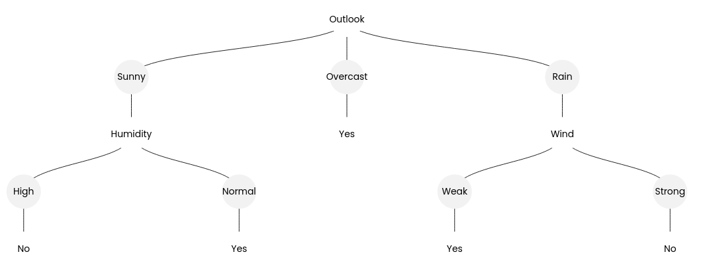

# C4.5 Algorithm

I previously developed a visualizer for the C4.5 algorithm, which you can find here: https://github.com/saliherdemk/C4.5-Algorithm-Visulizer

You may also find some useful resources in the source code if you're interested.

The C4.5 algorithm is used to construct decision trees for classification tasks by recursively splitting the dataset based on features that provide the maximum information gain.

## Entropy

Entropy is a measure of uncertainty or impurity in a dataset. It quantifies how mixed the classes in the data are. The more mixed the data, the higher the entropy; the more pure, the lower the entropy.

Entropy for a dataset $S$ is defined as:

$$
H(S) = - \sum_{i=1}^{c} p_i \log_2 p_i
$$

where:
- $S$ is the dataset.
- $c$ is the number of classes in the dataset.
- $p_i$ is the proportion of data points belonging to class $i$.

A certain case does not make people excited or surprised. For example, winning a lottery is much more surprising than getting tails on a coin toss. Surprise can be measured using the probability of the occurrence of these actions. For example:
- Coin toss results are equally surprising because both outcomes (heads or tails) have a probability of \( 1/2 \).
- Rolling a "6" on a die is more surprising because the probability of rolling any specific number is \( 1/6 \).

This relationship suggests that **less probable events cause more surprise**. Mathematically, this can be written as:

$$
\text{Surprise} = \frac{1}{\text{Probability}}
$$

However, if an occurrence is certain (probability = 1), the surprise is:

$$
\text{Surprise} = \frac{1}{1} = 1
$$

This is counterintuitive because certain events do not surprise us at all. To resolve this, we take the logarithm of the inverse of probability:

$$
\text{Surprise} = \log\left(\frac{1}{\text{Probability}}\right)
$$

This formula better captures the intuition of surprise:
- Higher probabilities result in lower surprise.
- Lower probabilities result in higher surprise.

The base of the logarithm can be chosen depending on the number of classes. For binary classification, we commonly use base 2 (measuring information in bits).

---

Let’s consider a bag containing 3 red balls and 7 blue balls. The probabilities of selecting a blue ball ($p_{\text{blue}}$) and a red ball ($p_{\text{red}}$) are:

$$
p_{\text{blue}} = \frac{7}{10}, \quad p_{\text{red}} = \frac{3}{10}
$$

The surprise for each outcome is:

- Surprise for a blue ball:
  $$
  \text{Surprise}_{\text{blue}} = \log_2\left(\frac{1}{p_{\text{blue}}}\right) = -\log_2(p_{\text{blue}})
  $$

- Surprise for a red ball:
  $$
  \text{Surprise}_{\text{red}} = \log_2\left(\frac{1}{p_{\text{red}}}\right) = -\log_2(p_{\text{red}})
  $$

Entropy aggregates these values by weighting the surprise of each outcome by its probability. The entropy of the bag is:

$$
H(S) = - \left( p_{\text{blue}} \log_2(p_{\text{blue}}) + p_{\text{red}} \log_2(p_{\text{red}}) \right)
$$

Substituting the probabilities:

$$
H(S) = - \left( \frac{7}{10} \log_2\left(\frac{7}{10}\right) + \frac{3}{10} \log_2\left(\frac{3}{10}\right) \right) \approx 0.88
$$

This number represents the expected surprise per selection. If the probabilities were \( 50\%-50\% \), the entropy would be 1, indicating maximum uncertainty.

Entropy gives us a way to measure the uncertainty in a dataset. Information Gain measures the reduction in entropy after splitting the dataset based on a particular feature.

The formula for Information Gain is:

$$
\text{Information Gain} = H(S) - \sum_{i=1}^{n} \frac{|S_i|}{|S|} H(S_i)
$$

Where:
- $H(S)$ is the entropy of the original dataset.
- $S_i$ are the subsets of $S$ created by splitting based on a feature.
- $|S_i| / |S|$ is the weight of each subset.

Information Gain helps us identify the feature that best reduces uncertainty and makes the dataset purer, driving the construction of the decision tree.

---

## Example

We will construct a decision tree for the "Play Tennis" dataset using the C4.5 algorithm.

### Dataset

| Outlook   | Temperature | Humidity | Wind    | Play Tennis |
|-----------|-------------|----------|---------|-------------|
| Sunny     | Hot         | High     | Weak    | No          |
| Sunny     | Hot         | High     | Strong  | No          |
| Overcast  | Hot         | High     | Weak    | Yes         |
| Rain      | Mild        | High     | Weak    | Yes         |
| Rain      | Cool        | Normal   | Weak    | Yes         |
| Rain      | Cool        | Normal   | Strong  | No          |
| Overcast  | Cool        | Normal   | Strong  | Yes         |
| Sunny     | Mild        | High     | Weak    | No          |
| Sunny     | Cool        | Normal   | Weak    | Yes         |
| Rain      | Mild        | Normal   | Weak    | Yes         |
| Sunny     | Mild        | Normal   | Strong  | Yes         |
| Overcast  | Mild        | High     | Strong  | Yes         |
| Overcast  | Hot         | Normal   | Weak    | Yes         |
| Rain      | Mild        | High     | Strong  | No          |

---

We have 14 samples in total:
- 9 "Yes" (Play Tennis).
- 5 "No" (Play Tennis).

Entropy $H(S)$ is calculated as:

$$
H(S) = -p_{\text{Yes}} \log_2(p_{\text{Yes}}) - p_{\text{No}} \log_2(p_{\text{No}})
$$

$$
p_{\text{Yes}} = \frac{9}{14}, \quad p_{\text{No}} = \frac{5}{14}
$$

$$
H(S) = -\frac{9}{14} \log_2\left(\frac{9}{14}\right) - \frac{5}{14} \log_2\left(\frac{5}{14}\right)
$$

$$
H(S) = -0.643 \cdot \log_2(0.643) - 0.357 \cdot \log_2(0.357)
$$

$$
H(S) \approx 0.940
$$

---

### Split the dataset by "Outlook":
- **Sunny**: 5 samples (2 "Yes", 3 "No").
- **Overcast**: 4 samples (4 "Yes", 0 "No").
- **Rain**: 5 samples (3 "Yes", 2 "No").

- **Sunny**:

$$
H(S_{\text{Sunny}}) = -\frac{2}{5} \log_2\left(\frac{2}{5}\right) - \frac{3}{5} \log_2\left(\frac{3}{5}\right)
$$

$$
H(S_{\text{Sunny}}) = -0.4 \cdot \log_2(0.4) - 0.6 \cdot \log_2(0.6)
$$

$$
H(S_{\text{Sunny}}) \approx 0.971
$$

- **Overcast**:

$$
H(S_{\text{Overcast}}) = -\frac{4}{4} \log_2\left(\frac{4}{4}\right)
$$

$$
H(S_{\text{Overcast}}) = 0
$$

- **Rain**:

$$
H(S_{\text{Rain}}) = -\frac{3}{5} \log_2\left(\frac{3}{5}\right) - \frac{2}{5} \log_2\left(\frac{2}{5}\right)
$$

$$
H(S_{\text{Rain}}) = -0.6 \cdot \log_2(0.6) - 0.4 \cdot \log_2(0.4)
$$

$$
H(S_{\text{Rain}}) \approx 0.971
$$

---

$$
H_{\text{Outlook}} = \frac{5}{14} H(S_{\text{Sunny}}) + \frac{4}{14} H(S_{\text{Overcast}}) + \frac{5}{14} H(S_{\text{Rain}})
$$

$$
H_{\text{Outlook}} = \frac{5}{14}(0.971) + \frac{4}{14}(0) + \frac{5}{14}(0.971)
$$

$$
H_{\text{Outlook}} = 0.693
$$

$$
\text{Information Gain} = H(S) - H_{\text{Outlook}}
$$

$$
\text{Information Gain} = 0.940 - 0.693
$$

$$
\text{Information Gain} = 0.247
$$

---

### Split the dataset by "Temperature":
- **Hot**: 4 samples (2 "Yes", 2 "No").
- **Mild**: 6 samples (4 "Yes", 2 "No").
- **Cool**: 4 samples (3 "Yes", 1 "No").

- **Hot**:

$$
H(S_{\text{Hot}}) = -\frac{2}{4} \log_2\left(\frac{2}{4}\right) - \frac{2}{4} \log_2\left(\frac{2}{4}\right)
$$

$$
H(S_{\text{Hot}}) = -0.5 \cdot \log_2(0.5) - 0.5 \cdot \log_2(0.5)
$$

$$
H(S_{\text{Hot}}) = 1
$$

- **Mild**:

$$
H(S_{\text{Mild}}) = -\frac{4}{6} \log_2\left(\frac{4}{6}\right) -\frac{2}{6} \log_2\left(\frac{2}{6}\right)
$$

$$
H(S_{\text{Mild}}) = 0.91
$$

- **Cool**:

$$
H(S_{\text{Cool}}) = -\frac{3}{4} \log_2\left(\frac{3}{4}\right) - \frac{1}{4} \log_2\left(\frac{1}{4}\right)
$$

$$
H(S_{\text{Cool}}) \approx 0.81
$$

---

$$
H_{\text{Temperature}} = \frac{4}{14} H(S_{\text{Hot}}) + \frac{6}{14} H(S_{\text{Mild}}) + \frac{4}{14} H(S_{\text{Cool}})
$$

$$
H_{\text{Temperature}} = \frac{4}{14}(1) + \frac{6}{14}(0.91) + \frac{4}{14}(0.81)
$$

$$
H_{\text{Temperature}} \approx 0.91
$$

$$
\text{Information Gain} = H(S) - H_{\text{Temperature}}
$$

$$
\text{Information Gain} = 0.940 - 0.91
$$

$$
\text{Information Gain} = 0.031
$$

---

### Split the dataset by "Humidity":
- **High**: 7 samples (3 "Yes", 4 "No").
- **Normal**: 7 samples (6 "Yes", 1 "No").

- **High**:

$$
H(S_{\text{High}}) = -\frac{3}{7} \log_2\left(\frac{3}{7}\right) - \frac{4}{7} \log_2\left(\frac{4}{7}\right)
$$

$$
H(S_{\text{High}}) \approx 0.98
$$

- **Normal**:

$$
H(S_{\text{Normal}}) = -\frac{6}{7} \log_2\left(\frac{6}{7}\right) - \frac{1}{7} \log_2\left(\frac{1}{7}\right)
$$

$$
H(S_{\text{Normal}}) \approx 0.59
$$

---

$$
H_{\text{Humidty}} = \frac{7}{14} H(S_{\text{High}}) + \frac{7}{14} H(S_{\text{Normal}})
$$

$$
H_{\text{Humidity}} = \frac{7}{14}(0.98) + \frac{7}{14}(0.59)
$$

$$
H_{\text{Humidity}} \approx 0.785
$$

$$
\text{Information Gain} = H(S) - H_{\text{HUmidity}}
$$

$$
\text{Information Gain} = 0.940 - 0.785
$$

$$
\text{Information Gain} = 0.155
$$

---

### Split the dataset by "Wind":
- **Weak**: 8 samples (6 "Yes", 2 "No").
- **Strong**: 6 samples (3 "Yes", 3 "No").

- **Weak**:

$$
H(S_{\text{Weak}}) = -\frac{6}{8} \log_2\left(\frac{6}{8}\right) - \frac{2}{8} \log_2\left(\frac{2}{8}\right)
$$

$$
H(S_{\text{Weak}}) \approx 0.81
$$

- **Strong**:

$$
H(S_{\text{Strong}}) = -\frac{3}{6} \log_2\left(\frac{3}{6}\right) - \frac{3}{6} \log_2\left(\frac{3}{6}\right)
$$

$$
H(S_{\text{Strong}}) = 1
$$

---

$$
H_{\text{Wind}} = \frac{8}{14} H(S_{\text{Weak}}) + \frac{6}{14} H(S_{\text{Strong}})
$$

$$
H_{\text{Humidity}} = \frac{8}{14}(0.81) + \frac{6}{14}(1)
$$

$$
H_{\text{Humidity}} \approx 0.963
$$

$$
\text{Information Gain} = H(S) - H_{\text{Humidity}}
$$

$$
\text{Information Gain} = 0.940 - 0.891
$$

$$
\text{Information Gain} = 0.049
$$

| Attribute| Information Gain |
|-------------|------|
|Outlook | **0.247** | 
|Temperature| 0.031|
|Humidity| 0.155|
|Wind| 0.049 |

**Outlook** has the highest Information Gain, so it becomes the root of the tree.

Then the process continues recursively for each branch. 

For example, when Outlook is Overcast, all labels are "Yes," so there is no need to calculate further. However, for the other values of Outlook, it is necessary to calculate which attribute will become the root for that subset.

  

## Final Tree

  

## References

- [Entropy Explanation - YouTube](https://www.youtube.com/watch?v=YtebGVx-Fxw)

