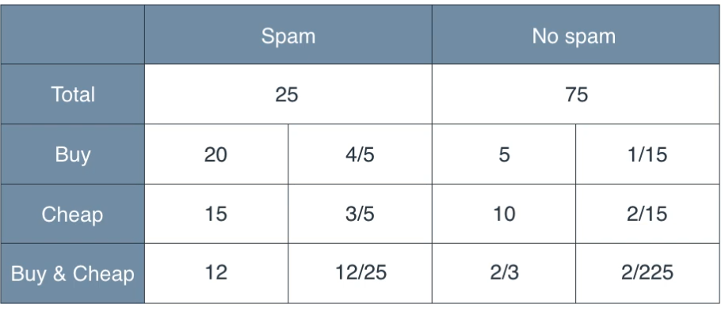

### Conditional Probability

The conditional probability of an event $A$ given that event $B$ has occurred is defined as:

$$
P(A \mid B) = \frac{P(A \cap B)}{P(B)}
$$

Where:
- $P(A \mid B)$: Probability of event $A$ occurring given that $B$ has occurred.
- $P(A \cap B)$: Probability of both $A$ and $B$ occurring.
- $P(B)$: Probability of event $B$ occurring, assuming $P(B) > 0$.

### Bayes Theorem

$$
P(A \mid B) = \frac{P(A \cap B)}{P(B)}
$$

$$
P(B \mid A) = \frac{P(B \cap A)}{P(A)}
$$

$$
since\ P(A \cap B) = P(B \cap A) 
$$

$$
P(A \mid B) = \frac{P(B \mid A) \cdot P(A)}{P(B)}
$$

# Naive Bayes 

  

$$
P(\text{Spam} \mid \text{Buy} \cap \text{Cheap}) = \frac{P(\text{Buy} \cap \text{Cheap} \mid \text{Spam}) \cdot P(\text{Spam})}{P(\text{Buy} \cap \text{Cheap})}
$$

---

- $P(\text{Spam}) = \frac{25}{100} = 0.25$
- $P(\text{No Spam}) = \frac{75}{100} = 0.75$

- $P(\text{Buy} \mid \text{Spam}) = \frac{20}{25} = 0.8$
- $P(\text{Cheap} \mid \text{Spam}) = \frac{15}{25} = 0.6$

- $P(\text{Buy} \mid \text{No Spam}) = \frac{5}{75} = 0.0667$
- $P(\text{Cheap} \mid \text{No Spam}) = \frac{10}{75} = 0.1333$

Assuming independence of words:

$$
P(\text{Buy} \cap \text{Cheap} \mid \text{Spam}) = P(\text{Buy} \mid \text{Spam}) \cdot P(\text{Cheap} \mid \text{Spam}) = 0.8 \cdot 0.6 = 0.48
$$

$$
P(\text{Buy} \cap \text{Cheap} \mid \text{No Spam}) = P(\text{Buy} \mid \text{No Spam}) \cdot P(\text{Cheap} \mid \text{No Spam}) = 0.0667 \cdot 0.1333 = 0.0089
$$

---

$$
P(\text{Buy} \cap \text{Cheap}) = P(\text{Buy} \cap \text{Cheap} \mid \text{Spam}) \cdot P(\text{Spam}) + P(\text{Buy} \cap \text{Cheap} \mid \text{No Spam}) \cdot P(\text{No Spam})
$$

$$
P(\text{Buy} \cap \text{Cheap}) = (0.48 \cdot 0.25) + (0.0089 \cdot 0.75) = 0.12 + 0.006675 = 0.126675
$$

---

$$
P(\text{Spam} \mid \text{Buy} \cap \text{Cheap}) = \frac{P(\text{Buy} \cap \text{Cheap} \mid \text{Spam}) \cdot P(\text{Spam})}{P(\text{Buy} \cap \text{Cheap})}
$$

$$
P(\text{Spam} \mid \text{Buy} \cap \text{Cheap}) = \frac{0.48 \cdot 0.25}{0.126675} = \frac{0.12}{0.126675} \approx 0.947
$$

Since the number of emails that contain 'Buy' and 'Cheap' is 12 and those that do not contain these features is 2/3, we can verify our calculations with

$$
\frac{12}{12 + \frac{2}{3}} \approx 0.947
$$

### Naive Bayes Classifier

The formula for Naive Bayes classification is:

$$
P(C \mid X_1, X_2, \dots, X_n) = \frac{P(C) \cdot \prod_{i=1}^n P(X_i \mid C)}{P(X_1, X_2, \dots, X_n)}
$$

Where:
- $P(C \mid X_1, X_2, \dots, X_n)$ is the posterior probability of class $C$ given the features $X_1, X_2, \dots, X_n$.
- $P(C)$ is the prior probability of class $C$, i.e., the probability of class $C$ occurring before observing any features.
- $P(X_i \mid C)$ is the likelihood of feature $X_i$ given the class $C$, i.e., the probability of feature $X_i$ occurring given class $C$.
- $P(X_1, X_2, \dots, X_n)$ is the evidence or the total probability of observing the features, and it is constant across all classes. Since it does not depend on the class C, it is typically ignored. When performing classification, our goal is to compare the posterior probabilities $P(C \mid X_1, X_2, \dots, X_n)$ across different classes.

---

The multiplication of the conditional probabilities comes from the conditional independence assumption in Naive Bayes. This assumption means that each feature $X_i$ is independent of the others, given the class $C$. Therefore, the joint likelihood of all features given the class is the product of their individual likelihoods:

$$
P(X_1, X_2, \dots, X_n \mid C) = P(X_1 \mid C) \cdot P(X_2 \mid C) \cdot \dots \cdot P(X_n \mid C).
$$

---

Probabilities can become extremely small, especially in high-dimensional problems, leading to numerical underflow when multiplied together. Applying the log transformation prevents this by converting multiplication into addition, making computations more stable.
   
For example, instead of multiplying probabilities:

$$
P(C \mid X_1, X_2, \dots, X_n) = P(C) \cdot \prod_{i=1}^n P(X_i \mid C),
$$

we take the logarithm:

$$
\log P(C \mid X_1, X_2, \dots, X_n) = \log (P(C) \cdot \prod_{i=1}^n P(X_i \mid C))
$$

$$
= \log P(C) + \sum_{i=1}^n \log P(X_i \mid C).
$$

$$
\hat{c} = argmax_c \left( \log p(c) + \sum_{i=1}^n \log p(x_i \mid c) \right)
$$

In this implementation, I will use **Gaussian Naive Bayes**, which assumes that each feature $x_i$ follows a Gaussian distribution for each class $c$. The conditional probability is given by:

$$
P(x_i \mid c) = \frac{1}{\sqrt{2 \pi \sigma_c^2}} \exp\left(-\frac{(x_i - \mu_c)^2}{2 \sigma_c^2}\right)
$$

Where:
- $\mu_c$: Mean of the feature $x_i$ for class $c$.
- $\sigma_c^2$: Variance of the feature $x_i$ for class $c$.

Other distributions, such as multinomial or Bernoulli, can be used in specific conditions depending on the nature of the features (e.g., categorical or binary data).

But normally, features need to be inspected separately, and a suitable probability density function (PDF) should be chosen for each.

## References

- https://www.youtube.com/watch?v=Q8l0Vip5YUw 
- https://www.youtube.com/watch?v=TLInuAorxqE

