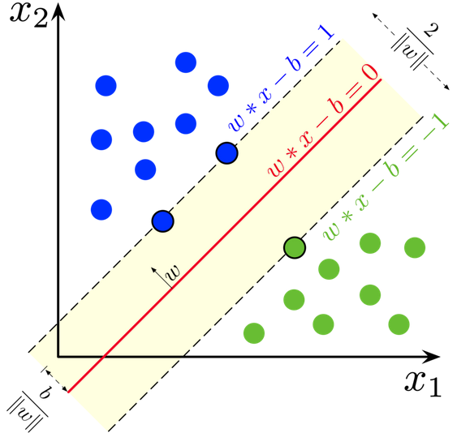
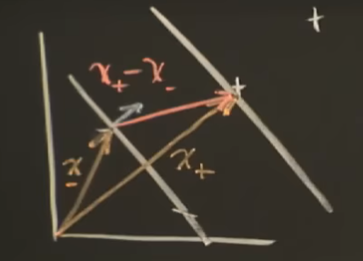

### Support Vector Machine (SVM)

Support Vector Machines (SVM) are supervised learning models used for classification and regression tasks. In classification, SVM finds the best boundary (called a hyperplane) that separates different classes with the maximum margin.

---

### Binary Classification and Linear Separability

Consider two classes of data in 2D space:

- Positive class (+1)
- Negative class (-1)

If they can be separated by a straight line, they are **linearly separable**.

---

### Decision Boundary and Hyperplane

 </img>

A hyperplane is a generalization of a line/plane to higher dimensions:

In this case it's a line,

$$
w_1 \cdot x_1 + w_2 \cdot x_2 + b = 0
$$

In 3d, it's a plane

$$
w_1 \cdot x_1 + w_2 \cdot x_2 + w_3 \cdot x_3 + b = 0
$$

In general

$$
w \cdot x + b = 0
$$

- $w$ is the normal vector to the hyperplane.
- $b$ is the bias (intercept).

The sign of $f(x) = w \cdot x + b$ tells us the class. Meaning that our decision rule is

$$
w \cdot u + b \ge 0 \quad then \quad it's \quad +
$$

where $u$ is the unknows that we want to predict.

$$
w \cdot x_+ + b \ge 1
$$

$$
w \cdot x_- + b \le -1
$$

$$
y_i (x_i \cdot w + b) \ge 1
$$

where $y_i = 1$ for + samples and $y_i = -1$ for - samples.

$$
y_i (x_i \cdot w + b) - 1 = 0
$$
for $x_i$ on the margin.

 </img>

$$
width = (x_+ - x_-) \cdot \frac{w}{||w||}
$$
which $\frac{w}{||w||}$ equivalent to a unit vector.

$$
y_i (x_i \cdot w + b) - 1 = 0

$$

for positive $x$ values, $y_i = 1$ so 

$$
x_i \cdot w = 1 - b
$$

for negative x values, $y_i = -1$ so 

$$
x_i \cdot w = b + 1
$$

$$
width = (x_+ - x_-) \cdot \frac{w}{||w||} = (x_+\cdot w - x_- \cdot w) \frac{1}{||w||}
$$

$$
= \frac{1 - b -b + 1 }{||w||} = \frac{2}{||w||} 
$$

We want to find the optimal hyperplane that maximizes the margin. The margin is given by:

$$
\text{margin} = \frac{2}{\|w\|}
$$

Maximizing the margin is equivalent to minimizing $\frac{1}{2}\|w\|^2$ (for convenience).

Subject to the constraint that all points are classified correctly **and** lie outside the margin:

$$
y_i (w \cdot x_i + b) \ge 1 \quad \text{for all } i
$$

Minimize:

$$
\frac{1}{2} \|w\|^2
$$

Subject to:

$$
y_i (w \cdot x_i + b) \ge 1
$$

This is a constrained optimization problem.

### Lagrangian

We use Lagrange multipliers $\alpha_i \ge 0$ to handle the inequality constraints. The Lagrangian becomes:

$$
L(w, b, \alpha) = \frac{1}{2} \|w\|^2 - \sum_i \alpha_i \left[ y_i (w \cdot x_i + b) - 1 \right]
$$

$$
\frac{\partial L}{\partial w} = w - \sum_i \alpha_i y_i x_i = 0
$$

$$
w = \sum_i \alpha_i y_i x_i
$$

$$
\frac{\partial L}{\partial b} = - \sum_i \alpha_i y_i = 0
$$

$$
\sum_i \alpha_i y_i = 0
$$

So our decision rule becomes

$$
\sum \alpha_i y_i x_i \cdot u + b \ge 0, \quad then \quad +
$$

## References

- https://www.youtube.com/watch?v=_PwhiWxHK8o
- https://www.youtube.com/watch?v=efR1C6CvhmE
- https://www.youtube.com/watch?v=Toet3EiSFcM
- https://www.youtube.com/watch?v=Qc5IyLW_hns
