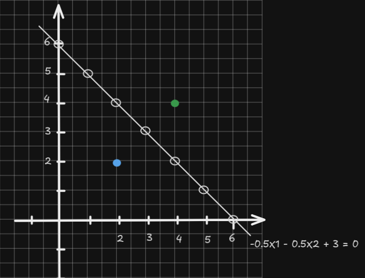

### Support Vector Machine (SVM)

Support Vector Machines (SVM) are supervised learning models used for classification and regression tasks. In classification, SVM finds the best boundary (called a hyperplane) that separates different classes with the maximum margin.

---

### Binary Classification and Linear Separability

Consider two classes of data in 2D space:

- Positive class (+1)
- Negative class (-1)

If they can be separated by a straight line, they are linearly separable.

---

### Decision Boundary and Hyperplane

 </img>

A hyperplane is a generalization of a line/plane to higher dimensions:

In this case it's a line,

$$
w_1 \cdot x_1 + w_2 \cdot x_2 + b = 0
$$

In 3d, it's a plane

$$
w_1 \cdot x_1 + w_2 \cdot x_2 + w_3 \cdot x_3 + b = 0
$$

In general

$$
w \cdot x + b = 0
$$

- $w$ is the normal vector to the hyperplane.
- $b$ is the bias (intercept).

The sign of $f(x) = w \cdot x + b$ tells us the class. Meaning that our decision rule is

$$
w \cdot u + b \ge 0 \quad then \quad it's \quad +
$$

where $u$ is the unknows that we want to predict.

$$
w \cdot x_+ + b \ge 1
$$

$$
w \cdot x_- + b \le -1
$$

$$
y_i (x_i \cdot w + b) \ge 1
$$

where $y_i = 1$ for + samples and $y_i = -1$ for - samples.

$$
y_i (x_i \cdot w + b) - 1 = 0
$$

for $x_i$ on the margin.

 </img>

$$
width = (x_+ - x_-) \cdot \frac{w}{||w||}
$$

which $\frac{w}{||w||}$ equivalent to a unit vector.

$$
y_i (x_i \cdot w + b) - 1 = 0
$$

for positive $x$ values, $y_i = 1$ so 

$$
x_i \cdot w = 1 - b
$$

for negative x values, $y_i = -1$ so 

$$
x_i \cdot w = b + 1
$$

$$
width = (x_+ - x_-) \cdot \frac{w}{||w||} = (x_+\cdot w - x_- \cdot w) \frac{1}{||w||}
$$

$$
= \frac{1 - b -b + 1 }{||w||} = \frac{2}{||w||} 
$$

We want to find the optimal hyperplane that maximizes the margin. The margin is given by:

$$
\text{margin} = \frac{2}{\|w\|}
$$

Maximizing the margin is equivalent to minimizing $\frac{1}{2}\|w\|^2$ (for convenience).

Subject to the constraint that all points are classified correctly and lie outside the margin:

$$
y_i (w \cdot x_i + b) \ge 1 \quad \text{for all } i
$$

Minimize:

$$
\frac{1}{2} \|w\|^2
$$

Subject to:

$$
y_i (w \cdot x_i + b) \ge 1
$$

This is a constrained optimization problem.

### Lagrangian

We use Lagrange multipliers $\alpha_i \ge 0$ to handle the inequality constraints. The Lagrangian becomes:

$$
L(w, b, \alpha) = \frac{1}{2} \|w\|^2 - \sum_i \alpha_i \left[ y_i (w \cdot x_i + b) - 1 \right]
$$

$$
\frac{\partial L}{\partial w} = w - \sum_i \alpha_i y_i x_i = 0
$$

$$
w = \sum_i \alpha_i y_i x_i
$$

$$
\frac{\partial L}{\partial b} = - \sum_i \alpha_i y_i = 0
$$

$$
\sum_i \alpha_i y_i = 0
$$

So $L$ becomes

$$
\sum_i \alpha_i - \frac{1}{2}\sum_i\sum_j\alpha_i\alpha_jy_iy_jx_i \cdot x_j
$$

And our decision rule becomes

$$
\sum \alpha_i y_i x_i \cdot u + b \ge 0, \quad then \quad +
$$

#### Example

| Point | $x$       | $y$ |
|-------|---------------|---------|
| 1     | (2, 2)  | +1 |
| 2     | (4, 4)  | -1 |

---

$$
\max_{\alpha} \sum_{i=1}^2 \alpha_i - \frac{1}{2} \sum_{i=1}^2 \sum_{j=1}^2 \alpha_i \alpha_j y_i y_j (x_i \cdot x_j)
$$

Subject to:

- $\alpha_1, \alpha_2 \ge 0$
- $\alpha_1 y_1 + \alpha_2 y_2 = 0$

Let:

- $\alpha_1 = a$
- $\alpha_2 = b$

---

- $x_1 \cdot x_1 = (2,2) \cdot (2,2) = 8$
- $x_2 \cdot x_2 = (4,4) \cdot (4,4) = 32$
- $x_1 \cdot x_2 = (2,2) \cdot (4,4) = 16$

So our objective becomes:

$$
L(a, b) = a + b - \frac{1}{2} \left[ 
a^2 \cdot 8 + b^2 \cdot 32 - 2ab \cdot 16
\right]
= a + b - \frac{1}{2}(8a^2 + 32b^2 - 32ab)
$$

---

We have:

$$
a \cdot y_1 + b \cdot y_2 = 0 \Rightarrow a = b
$$

Substitute into the equation:

$$
L(a) = 2a - \frac{1}{2}(8a^2 + 32a^2 - 32a^2)
= 2a - \frac{1}{2}(8a^2) = 2a - 4a^2
$$

---
Take derivative:

$$
\frac{dL}{da} = 2 - 8a = 0 \Rightarrow a = 0.25
$$

So:

- $\alpha_1 = \alpha_2 = 0.25$

---

$$
w = \sum \alpha_i y_i x_i = 0.25 \cdot 1 \cdot (2,2) + 0.25 \cdot (-1) \cdot (4,4)
= (0.5, 0.5) - (1, 1) = (-0.5, -0.5)
$$

Use support vector $x_1 = (2,2), y=+1$:

$$
b = y - w \cdot x = 1 - ((-0.5)(2) + (-0.5)(2)) = 1 - (-2) = 3
$$

---

$$
f(x) = w \cdot x + b = -0.5x_1 - 0.5x_2 + 3
$$

This function separates the two points with the maximum margin.

 </img>

### Kernel Functions

In many real-world problems, data points are not linearly separable in the original input space. Kernel functions allow us to implicitly map data to a higher-dimensional feature space where linear separation is possible, without explicitly computing the mapping. This technique is called the kernel trick.

---

### Kernel

A kernel function $K(x, z)$ is a function that computes the dot product of two vectors $x$ and $z$ in a higher-dimensional space:

$$
K(x, z) = \phi(x) \cdot \phi(z)
$$

Here, $\phi(x)$ is the feature map that projects the input data into a higher-dimensional space.

The advantage of using kernel functions is that we don't need to explicitly calculate $\phi(x)$. Instead, we can compute the kernel directly in the original input space, which saves computational resources.

---

### Types of Kernel Functions

Some of the commonly used kernel functions are:

#### 1. Linear Kernel

The linear kernel is the simplest kernel, where no mapping to a higher-dimensional space occurs. It’s just the regular dot product:

$$
K(x, z) = x \cdot z
$$

This corresponds to a linear SVM in the original feature space.

#### 2. Polynomial Kernel

The polynomial kernel maps data to a higher-dimensional space by considering polynomial combinations of the original features. It is defined as:

$$
K(x, z) = (x \cdot z + c)^d
$$

where:
- $c$ is a constant (often $c = 0$),
- $d$ is the degree of the polynomial.

This kernel allows the decision boundary to be nonlinear in the input space.

#### 3. Radial Basis Function (RBF) Kernel (Gaussian Kernel)

The RBF kernel is one of the most widely used kernels. It maps data into an infinite-dimensional space and is defined as:

$$
K(x, z) = \exp\left( -\frac{\|x - z\|^2}{2\sigma^2} \right)
$$

where:
- $\sigma$ controls the width of the Gaussian function,
- $\|x - z\|^2$ is the squared Euclidean distance between the points $x$ and $z$.

The RBF kernel can capture highly nonlinear decision boundaries and is especially useful for complex data distributions.

---

### Kernelized SVM

With kernels, the optimization problem remains the same, but instead of using the original dot product $x_i \cdot x_j$, we replace it with the kernel function $K(x_i, x_j)$:

The objective is still to maximize the margin and minimize $\frac{1}{2} \|w\|^2$, but with the decision boundary now computed in the higher-dimensional space using kernels. The final classifier in the case of kernels is:

$$
f(x) = \text{sign} \left( \sum_{i=1}^n \alpha_i y_i K(x_i, x) + b \right)
$$

where $K(x_i, x)$ is the kernel function and $\alpha_i$, $y_i$, and $b$ are as before.

## References

- https://www.youtube.com/watch?v=_PwhiWxHK8o
- https://www.youtube.com/watch?v=efR1C6CvhmE
- https://www.youtube.com/watch?v=Toet3EiSFcM
- https://www.youtube.com/watch?v=Qc5IyLW_hns
- https://www.youtube.com/watch?v=K9jOj9QI9rA
- https://www.youtube.com/watch?v=TMyOR1NezBY
