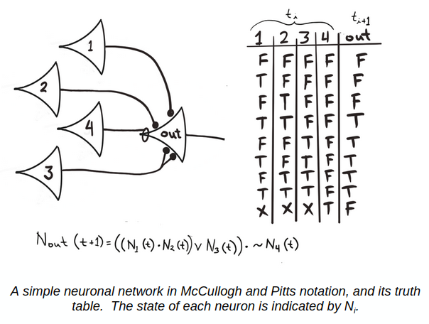

# A LOGICAL CALCULUS OF THE IDEAS IMMANENT IN NERVOUS ACTIVITY

**WARREN S. MCCULLOCH AND WALTER PITTS - 1943**

## McCulloch and Pitts Neuronal Model

The 1943 McCulloch and Pitts model represents neurons as binary units that fire based on their inputs and thresholds. The activity of a neuron is governed by the following formula:

$$
g(x_1, x_2, x_3,...,x_n) = g(x) = \sum_{i=1}^{n}x_i 
$$
$$
y = f(g(x)) = 
\begin{cases} 
1 & \text{if } g(x) \geq \theta, \\
0 & \text{otherwise}.
\end{cases}
$$

Where:
- $f(g(x))$ is a threshold function
- $g(x)$ is the sum of the inputs $x_1,x_2,…,x_n$
- $\theta$ is the threshold value

## Formal Approach In Original Paper 

$$
N_{\text{out}}(t+1) = S \left\{ \prod_{m=1}^q \neg N_{jm}(t) \cdot \sum_{s \in K_{\text{out}}} \prod_{z \in s} N_z(t) \right\}
$$

Where:

- $N_{\text{out}}(t+1)$: Output of the neuron at time $t+1$.
- $S$: Step function that determines whether the neuron fires or not based on the inputs.
- $\neg N_{jm}(t)$: Represents the inhibitory inputs. These must be deactivated (i.e., $N_{jm}(t) = 0$) for the neuron to fire.
- $N_z(t)$: Represents the excitatory inputs, grouped into sets. 
- $K_{\text{out}}$: Set of combinations of excitatory inputs that lead to firing.

#### Inhibitory Term: $\prod_{m=1}^q \neg N_{jm}(t)$

This means that, since we perform and operation with rest of them $(\cdot)$ if any inhibitory neuron fires in set of $N_{jm}$, then our output will not fired.

#### Excitatory Term: $\sum_{s \in K_{\text{out}}} \prod_{z \in s} N_z(t)$ 

This is a bit trickier because it simulates a threshold mechanism. First, we perform an and operation within each set $s$ that contains excitatory neurons $N_z$. The product $\prod_{z \in s} N_z(t)$ ensures that the excitatory neurons in each set must all be active for that set to contribute to the sum. Then, the summation $\sum_{s \in K_{\text{out}}}$ acts like an OR operation, simulating the accumulation of excitatory inputs from multiple sets.

For example, if $N_1$ and $N_2$ are both active, they together are sufficient to exceed the threshold and cause the neuron to fire. However, if $N_3$ is active by itself, it can also exceed the threshold independently, without needing other excitatory inputs. 

  

$$
N_{\text{out}}(t+1) = \left( (N_1 \land N_2) \lor N_3 \right) \land \neg N_4
$$

## Referances

https://www.cs.cmu.edu/~./epxing/Class/10715/reading/McCulloch.and.Pitts.pdf

https://marlin.life.utsa.edu/mcculloch-and-pitts.html

