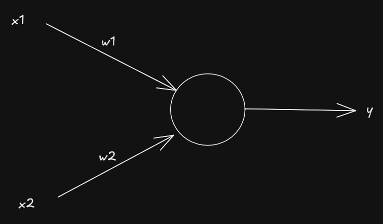

# The Organization of Behavior - Chapter 4

**Donald Olding Hebb - 1949**

I couldn't come across the famous "neurons that fire together wire together" quote, so it's not the original summary that the author presented. What Hebb suggests is:

*Let us assume then that the persistence or repetition of a reverberatory activity (or “trace”) tends to induce lasting cellular changes that add to its stability. The assumption can be precisely stated as follows: When an axon of cell A is near enough to excite a cell B and repeatedly or persistently takes part in firing it, some growth process or metabolic change takes place in one or both cells such that A’s efficiency, as one of the cells firing B, is increased.*

As I understand it: 

If there is a persistent relationship between two neurons, the connection between those neurons undergoes changes that make it easier to activate the connection later. For example, if neuron A repeatedly causes neuron B to fire, then the connection between these neurons is modified in a way that makes neuron B more sensitive to signals from neuron A. These changes might include: more neurotransmitter release at the synapse, more receptor sites on neuron B, or an increase in synapse size. 

Hebbian learning strengthens the connections between neurons that repeatedly activate together. The neurons cooperate to achieve a shared outcome.

For example:

Neuron A may encode a visual cue, like the sight of a red light. Neuron B may activate a motor response, like pressing the brake pedal. When this sequence happens repeatedly, the connection between A and B becomes stronger. It's like Pavlov's dog.

So the "fire together, wire together" quote is a little bit off since one of them needs to fire slightly earlier than the other.

---

## Evolving to the formula we use in neural nets

Hebb's principle inspired how we update connection weights in artificial neural networks. A basic Hebbian-like learning rule can be expressed mathematically as:

$$
\Delta w_{ij} = \eta \cdot x_i \cdot y_j
$$

Where:
- $\Delta w_{ij}$ is the change in weight for the connection between input neuron $i$ and output neuron $j$.
- $\eta$ is the learning rate, a small positive number.
- $x_i$ is the activity of input neuron $i$.
- $y_j$ is the activity of the output neuron.

Which is the same thing as 

$$ \Delta w = \eta \cdot x^T \otimes y $$
if we vectorize the calcualtions.

- $\eta$ is the still learning rate,
- $x^T$ is the transpose of the input vector,
- $y$ is the expected output.
- $\otimes$ is outer product.

This formula aligns with Hebb's principle: if both $x_i$ and $y_j$ are active together (e.g., they "fire together"), the weight $w_{ij}$ increases. If one of them is not active, then the $\Delta w_{ij}$ will be 0 and there will be no change. 

### Example: AND Gate

We start with the same input-output pairs for the AND gate:

| $x_1$ | $x_2$ | Expected Output ($y$) |
|:----:|:----:|:--------------------:|
|   0  |   0  |          0           |
|   0  |   1  |          0           |
|   1  |   0  |          0           |
|   1  |   1  |          1           |

  

We initialize the weights ($w_1$ and $w_2$) to small random values, say 0.1.

The learning rate ($\eta$) is set to 0.1.

## Iteration 1:

#### for $x_1 = 0, x_2 = 0$, y = 0

$$
\Delta w = 0.1 \cdot \begin{bmatrix} 0 & 0 \end{bmatrix} \cdot 0 = \begin{bmatrix} 0 \\ 0 \end{bmatrix}
$$

$$
w = \begin{bmatrix} 0.1 \\ 0.1 \end{bmatrix} + \begin{bmatrix} 0 \\ 0 \end{bmatrix} = \begin{bmatrix} 0.1 \\ 0.1 \end{bmatrix}
$$

---
#### for $x_1 = 0, x_2 = 1$, y = 0

$$
\Delta w = 0.1 \cdot \begin{bmatrix} 0 & 1 \end{bmatrix} \cdot 0 = \begin{bmatrix} 0 \\ 0 \end{bmatrix}
$$

$$
w = \begin{bmatrix} 0.1 \\ 0.1 \end{bmatrix} + \begin{bmatrix} 0 \\ 0 \end{bmatrix} = \begin{bmatrix} 0.1 \\ 0.1 \end{bmatrix}
$$

---
#### for $x_1 = 1, x_2 = 0$, y = 0

$$
\Delta w = 0.1 \cdot \begin{bmatrix} 1 & 0 \end{bmatrix} \cdot 0 = \begin{bmatrix} 0 \\ 0 \end{bmatrix}
$$

$$
w = \begin{bmatrix} 0.1 \\ 0.1 \end{bmatrix} + \begin{bmatrix} 0 \\ 0 \end{bmatrix} = \begin{bmatrix} 0.1 \\ 0.1 \end{bmatrix}
$$

---
#### for $x_1 = 1, x_2 = 1$, y = 1

$$
\Delta w = 0.1 \cdot \begin{bmatrix} 1 & 1 \end{bmatrix} \cdot 1 = \begin{bmatrix} 0.1 \\ 0.1 \end{bmatrix}
$$

$$
w = \begin{bmatrix} 0.1 \\ 0.1 \end{bmatrix} + \begin{bmatrix} 0.1 \\ 0.1 \end{bmatrix} = \begin{bmatrix} 0.2 \\ 0.2 \end{bmatrix}
$$

---

| iteration | weights values|
|:----:|:----:|
|   0  | 0.1, 0.1|
|   1  |0.2, 0.2|
|   2  |0.3, 0.3|

---

### Test

| $x_1$ | $x_2$ | Predicted Output ($y$) = $x_1 \cdot w_1 + x_2 \cdot w_2$ |
|:----:|:----:|:------------------------------------------------------:|
|   0  |   0  | $0 \cdot 0.3 + 0 \cdot 0.3 = 0$                        |
|   0  |   1  | $0 \cdot 0.3 + 1 \cdot 0.3 = 0.3$|
|   1  |   0  | $1 \cdot 0.3 + 0 \cdot 0.3 = 0.3$|
|   1  |   1  | $1 \cdot 0.3 + 1 \cdot 0.3 = 0.6$ |

The output values are not exactly 0 or 1 because we haven't applied a threshold function (e.g., step function). In a real neural network, the output would typically be passed through a threshold function to convert it to 0 or 1. For this example, we can apply a simple threshold function:

$$
y = \begin{cases} 
1 & \text{if output} \geq 0.5 \\
0 & \text{if output} < 0.5 
\end{cases}
$$

| $x_1$ | $x_2$ | Predicted Output (After Threshold) |
|:----:|:----:|:---------------------------------:|
|   0  |   0  | 0                                 |
|   0  |   1  | 0                                 |
|   1  |   0  | 0                                 |
|   1  |   1  | 1                                 |

# Future

implement https://oar.a-star.edu.sg/storage/2/2jep0k6mw7/gupta.pdf after backpropagation paper

## References

- https://archive.org/details/in.ernet.dli.2015.168156/page/n83/mode/2up?view=theater
- https://www.youtube.com/watch?v=-wakk5Iwqj8&t=24s
- https://www.youtube.com/watch?v=WOH32ISbkOw

