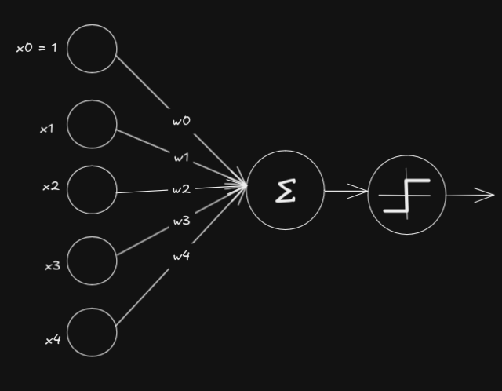

# The Perceptron / Principles of Neurodynamics 

**Frank Rosenblatt - 1958 / 1962**

  

This $x_0 = 1$ introduces a new parameter, which we now call the bias. In the forward pass, the output is calculated as follows:

$$
z = \sum_{i=0}^{n} w_i x_i = w_0 x_0 + w_1 x_1 + w_2 x_2 + \dots + w_n x_n
$$

Where:
- $z$ is the weighted sum.
- $w_i$ are the weights for each input $x_i$.
- $x_0 = 1$ and $w_0$ is the bias term.

The perceptron's output $y$ is determined by applying the step function:

$$
y = 
\begin{cases} 
1 & \text{if } z \geq 0 \\
0 & \text{if } z < 0
\end{cases}
$$

Here, the bias $w_0$ shifts the decision boundary, allowing the perceptron to classify inputs more flexibly.

If we convert the elements to a matrix form, our formula simplifies to:

$$
f(x) = w^T x + b
$$

where the bias $b$ needs to be broadcasted before the addition, which I implemented at [Grada](https://github.com/saliherdemk/Grada).

## Learning Rule

It's difficult to extract the exact formula from the book, but the standard learning rule formula is as follows:

$$
\mathbf{w} \leftarrow \mathbf{w} + \Delta \mathbf{w}
$$

$$
\mathbf{b} \leftarrow \mathbf{b} + \Delta \mathbf{b}
$$

$$
\Delta \mathbf{w} = \eta (y - \hat{y}) \mathbf{x}
$$

$$
\Delta \mathbf{b} = \eta (y - \hat{y})
$$

where:
- $\mathbf{w}$ is the vector of weights,
- $\mathbf{x}$ is the input vector,
- $\hat{y}$ is the predicted output,
- $y$ is the true output,
- $\eta$ is the learning rate.

## References

- https://www.ling.upenn.edu/courses/cogs501/Rosenblatt1958.pdf 
- https://archive.org/details/principles-of-neurodynamics/page/n311/mode/2up?view=theater
- https://www.youtube.com/watch?v=9ttOIR0vG-4

