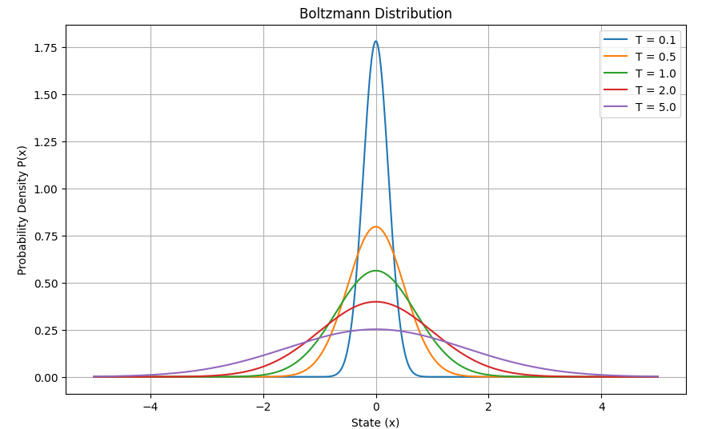
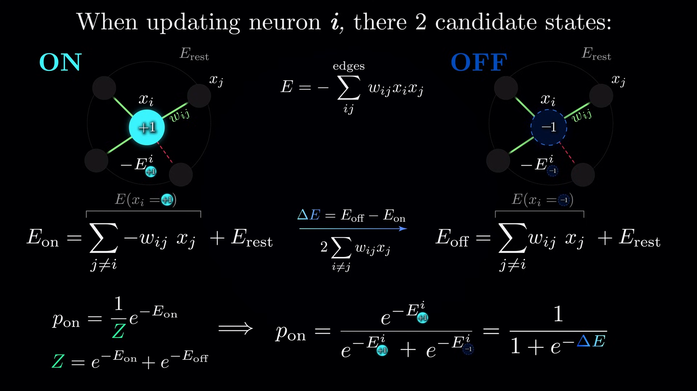
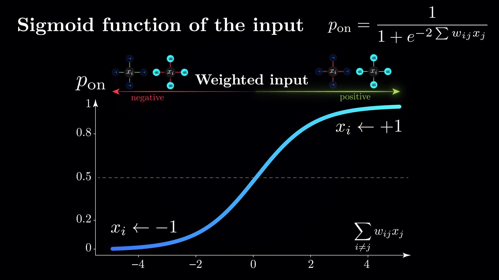

# Implementation Results

[Boltzmann Machines](https://github.com/saliherdemk/Boltzmann-Machines)

</img>

Unlike Hopfield Networks, Boltzmann Machines use **stochastic neuron updates** and can model probability distributions over binary patterns. They are a more powerful class of energy-based models that can generate data by sampling from their learned distribution.

# Quick Recap: Hopfield Networks

Hopfield Networks are recurrent neural networks designed to function as **associative memory systems**. They store binary patterns as **stable energy minima** and recall stored patterns from noisy inputs by iteratively minimizing an energy function.

---

They consist of binary neurons $s_i \in \{-1, +1\}$ with symmetric weights $w_{ij} = w_{ji}$, no self-connections, and evolve deterministically to lower energy.

The energy function is:

$$
E(\mathbf{s}) = -\frac{1}{2} \sum_{i \neq j} w_{ij} s_i s_j + \sum_i \theta_i s_i
$$

Updates are **deterministic**:

$$
s_k \leftarrow \text{sign} \left( \sum_j w_{kj} s_j - \theta_k \right)
$$

This guarantees that each asynchronous update **lowers or preserves** energy.

# Boltzmann Machines

Boltzmann Machines generalize Hopfield Networks by introducing stochastic updates and allowing the system to explore different states by sampling from a probability distribution.

For a binary state vector $\mathbf{s} \in \{-1, +1\}^N$, the energy function of a Boltzmann Machine is:

$$
E(\mathbf{s}) = -\frac{1}{2} \sum_{i \neq j} w_{ij} s_i s_j - \sum_i b_i s_i
$$

- $w_{ij}$: symmetric weights between units  
- $b_i$: bias (threshold) of unit $i$  
- $s_i$: state of unit $i$  

Unlike Hopfield Networks, Boltzmann Machines define a probability distribution over all possible binary states:

The Boltzmann distribution, used to assign a probability to each possible configuration $\mathbf{s}$ based on its energy.

For a state $\mathbf{s}$ with energy $E(\mathbf{s})$, the Boltzmann distribution is:

$$
P(\mathbf{s}) = \frac{1}{Z} e^{\left(-\frac{E(\mathbf{s})}{T}\right)}
$$

- $E(\mathbf{s})$: Energy of the state $\mathbf{s}$
- $T$: Temperature, a positive scalar
- $Z$: Partition function, ensures probabilities sum to 1:

$$
Z = \sum_{\mathbf{s}} e^{\left(-\frac{E(\mathbf{s})}{T}\right)}
$$

The Boltzmann distribution defines a probability distribution over states. Lower-energy states are more probable. Instead of always choosing the lowest-energy state (like in Hopfield networks), it assigns probabilistic preference based on energy.

Temperature controls how sharply the system prefers lower-energy states:

| Temperature $T$ | Behavior |
|------------------|----------|
| $T \to 0$ | Becomes greedy: sharply favors the lowest-energy states |
| $T = 1$ | Standard Boltzmann distribution |
| $T \to \infty$ | Becomes uniform: all states are nearly equally likely |

- At high temperature, the system explores freely, even accepting high-energy states — useful in learning or escaping local minima.
- At low temperature, the system becomes deterministic, settling into low-energy (high-probability) configurations.

</img>

Right there $E(s) = x^2$ which is chosen arbitrarily. In Boltzmann Machine, the energy function is defined by the model's architecture and parameters (weights and biases). So for lower temperature values, the model is more likely to choose the learned example, while for higher temperatures it is more likely to choose samples that are similar but exploratory.

Also, we want to compute the probability of a state in a Boltzmann Machine, we need to compute partition function.

$$
Z = \sum_{\mathbf{s}} e^{\left(-\frac{E(\mathbf{s})}{T}\right)}
$$

### Learning

We’re given a dataset of binary vectors:

$$
D= \{s(1),s(2),...,s(N)\}
$$

The likelihood of the dataset under the Boltzmann Machine model is the product of the probabilities of each state:
P(D)=∏n=1NP(s(n))

$$
P(D) = \prod_{n=1}^N P(s^n)
$$

Taking the log turns this product into a sum

$$
L(w) = \sum_{n=1}^N log(P(s^n))
$$

Since the probability of each state is given by

$$
P(s^n) = \frac{e^{-E(s^n)}}{Z}
$$

The log-likelihood of the parameters given the data is:

$$
L(w) = \sum_{n=1}^N logP(s^{n}) = \sum_{n=1}^N (-E(s^n) -logZ)
$$

Take the gradient of the log-likelihood $\mathcal{L}(w)$ with respect to a weight $w_{ij}$:

$$
\frac{\partial \mathcal{L}}{\partial w_{ij}} = -\sum_{n=1}^N \frac{\partial E(s^{(n)})}{\partial w_{ij}} - \sum_{n=1}^N \frac{\partial \log Z}{\partial w_{ij}}
$$

Energy function:

$$
E(s) = -\frac{1}{2} \sum_{i \ne j} w_{ij} s_i s_j
$$

$$
\frac{\partial E(s)}{\partial w_{ij}} = -s_i s_j
$$

Thus:

$$
-\sum_{n=1}^N \frac{\partial E(s^{(n)})}{\partial w_{ij}} = \sum_{n=1}^N s^{(n)}_i s^{(n)}_j = N \cdot \langle s_i s_j \rangle_{\text{data}}
$$

$$
\langle s_i s_j \rangle_{data} = \frac{1}{N} \sum_{n=1}^N s_i^n s_j^n
$$

The sum is simply N times the average correlation of $s_i s_j$ over the data, denoted as$\langle s_i s_j \rangle$.

This value measures how often and how strongly the two units tend to be aligned (both +1 or both -1) or anti-aligned (one +1, other -1) across the whole dataset.

Suppose you have a dataset $D$ with 4 binary patterns of 3 neurons each ($s_0, s_1, s_2$):

| Pattern # | $s_0$ | $s_1$ | $s_2$ |
|-----------|---------|---------|---------|
| 1         | +1      | +1      | -1      |
| 2         | -1      | -1      | +1      |
| 3         | +1      | +1      | +1      |
| 4         | -1      | +1      | -1      |

### Compute $\langle s_0 s_1 \rangle_{\text{data}}$:

Calculate $s_0 s_1$ for each pattern:

| Pattern # | $s_0$ | $s_1$ | $s_0 s_1$ |
|-----------|---------|---------|-------------|
| 1         | +1      | +1      | +1          |
| 2         | -1      | -1      | +1          |
| 3         | +1      | +1      | +1          |
| 4         | -1      | +1      | -1          |

Sum these products:

$$
1 + 1 + 1 + (-1) = 2
$$

Divide by number of patterns (4):

$$
\langle s_0 s_1 \rangle_{\text{data}} = \frac{2}{4} = 0.5
$$

### Compute $\langle s_0 s_2 \rangle_{\text{data}}$:

Calculate $s_0 s_2$ for each pattern:

| Pattern # | $s_0$ | $s_2$ | $s_0 s_2$ |
|-----------|---------|---------|-------------|
| 1         | +1      | -1      | -1          |
| 2         | -1      | +1      | -1          |
| 3         | +1      | +1      | +1          |
| 4         | -1      | -1      | +1          |

Sum:

$$
-1 + (-1) + 1 + 1 = 0
$$

Average:

$$
\langle s_0 s_2 \rangle_{\text{data}} = \frac{0}{4} = 0
$$

- $\langle s_0 s_1 \rangle = 0.5$: $s_0$ and $s_1$ tend to be **somewhat aligned**.
- $\langle s_0 s_2 \rangle = 0$: $s_0$ and $s_2$ have **no consistent correlation**.

This is what the learning algorithm tries to capture by updating the weights — it adjusts $w_{ij}$ to reflect these correlations in the model distribution.

For $\log Z$

$$
\frac{\partial \log Z}{\partial w_{ij}} = \frac{1}{Z} \frac{\partial Z}{\partial w_{ij}} = \frac{1}{Z} \cdot \frac{\partial}{\partial w_{ij}} \sum_s e^{-E(s)}
$$

P(s) was
$$
P(s) = \frac{e^{-E(s)}}{Z}
$$

so 

$$
\frac{\partial \log Z}{\partial w_{ij}} = \sum_s P(s) \cdot \left( -\frac{\partial E(s)}{\partial w_{ij}} \right) 
$$

Which simplifies to:

$$
\frac{\partial \log Z}{\partial w_{ij}} = \sum_s P(s) s_i s_j = \langle s_i s_j \rangle_{\text{model}}
$$

This is a true expectation under the model’s distribution, even over states that don’t appear in the dataset. The model is assigning a probability to every possible binary state -even unobserved ones.

$\langle s_i s_j \rangle_{data}$= how often $s_i$ and $s_j$ are on together in the actual dataset

$\langle s_i s_j \rangle_{model}$= how often the model thinks $s_i$ and $s_j$ will be on together 

During training, the gradient of the log-likelihood gives us:

$$
\frac{\partial L}{\partial w_{ij}} = \langle s_i s_j \rangle_{data} - \langle s_i s_j \rangle_{model}
$$

If the data says $s_i$ and $s_j$ appear together more than the model expects, increase $w_{ij}$.

If the model thinks they occur more than they actually do, decrease $w_{ij}$.

So we compare how correlated two neurons are in reality vs in imagination and adjust our beliefs (weights) to better match reality.

### Optimization

$$
Z = \sum_{\mathbf{s}} e^{\left(-\frac{E(\mathbf{s})}{T}\right)}
$$

The partition function sums over all possible binary state vectors $\mathbf{s}$. If we have $N$ units, there are $2^N$ combinations. Even for moderate $N$ (e.g., 100), this becomes computationally infeasible.  
So, we can't directly calculate $P(\mathbf{s})$.

#### Gibbs Sampling

</img>

So 

$$
p_{on} = \frac{1}{1 + e^{-2 \sum w_{ij}x_j}}
$$

</img>

Gibbs Sampling is a Markov Chain Monte Carlo method used to approximate sampling from complex probability distributions like the Boltzmann distribution without enumerating all states.

- The idea is to sample each unit $s_i$ sequentially conditioned on the current states of all other units $\mathbf{s}_{\setminus i}$.

- Given the current states of all other units, the conditional probability for unit $i$ is:

$$
P\left(s_i = 1 \mid \mathbf{s}_{\setminus i}\right) = \sigma\left(\sum_j w_{ij} s_j + b_i\right)
$$

where $\sigma(x) = \frac{1}{1 + e^{-x}}$ is the sigmoid function.

- Gibbs sampling proceeds by:
  1. Initializing the state vector $\mathbf{s}$ randomly or from data.
  2. Iteratively updating each unit $s_i$ by sampling from its conditional distribution.
  3. Repeating these updates multiple times until the samples approximate the model's equilibrium distribution.

Gibbs Sampling lets us **approximate the expectations** under the model distribution needed for learning:

$$
\langle s_i s_j \rangle_{\text{model}} \approx \frac{1}{K} \sum_{k=1}^K s_i^{(k)} s_j^{(k)}
$$

where $s^{(k)}$ are samples generated by Gibbs sampling.

This sampling-based approach circumvents the need to compute the partition function explicitly, enabling practical training of Boltzmann Machines.

From notebook, here is the true and sampled distribution

| State        | Approx. Prob | Exact Prob |
|--------------|--------------|------------|
| [-1, -1, -1] |       0.2002 |     0.2221 |
| [-1, -1,  1] |       0.1068 |     0.1030 |
| [-1,  1, -1] |       0.1038 |     0.1186 |
| [-1,  1,  1] |       0.1343 |     0.1536 |
| [ 1, -1, -1] |       0.1505 |     0.1794 |
| [ 1, -1,  1] |       0.0917 |     0.0856 |
| [ 1,  1, -1] |       0.0865 |     0.0591 |
| [ 1,  1,  1] |       0.1263 |     0.0787 |

### Restricted Boltzmann Machines (RBMs) and Contrastive Divergence

RBMs are a special type of Boltzmann Machine designed to be easier to train on large datasets like images.

- **Architecture**:
  - Two layers:  
    - Visible layer $\mathbf{v} \in \{0,1\}^D$ (observed data)  
    - Hidden layer $\mathbf{h} \in \{0,1\}^F$ (latent features)
  - No intra-layer connections (visible units are not connected to each other, and hidden units are not connected to each other).  
  - Bipartite graph structure simplifies sampling and inference.

- **Energy function** of RBM:

  $$
  E(\mathbf{v}, \mathbf{h}) = - \sum_{i=1}^D \sum_{j=1}^F v_i w_{ij} h_j - \sum_{i=1}^D b_i v_i - \sum_{j=1}^F c_j h_j
  $$

  Where:  
  - $w_{ij}$ are weights between visible unit $i$ and hidden unit $j$  
  - $b_i$ is bias for visible unit $i$  
  - $c_j$ is bias for hidden unit $j$

- **Probability distribution**:

  $$
  P(\mathbf{v}, \mathbf{h}) = \frac{1}{Z} e^{(-E(\mathbf{v}, \mathbf{h}))}
  $$

  Marginalizing hidden or visible units yields the model's distribution over observed data.

- **Conditional distributions** are easy to compute because of bipartite structure:

  $$
  P(h_j = 1 | \mathbf{v}) = \sigma\left(\sum_i w_{ij} v_i + c_j\right)
  $$

  $$
  P(v_i = 1 | \mathbf{h}) = \sigma\left(\sum_j w_{ij} h_j + b_i\right)
  $$

  where $\sigma(x)$ is the sigmoid function.

## Contrastive Divergence (CD) 

Exact maximum likelihood learning in RBMs requires computing expectations over the model distribution, which is intractable for large models.

**Contrastive Divergence (CD-k)** is an efficient approximate algorithm to update weights:

- **Idea**:  
  Use Gibbs sampling initialized at a data example and run it for only $k$ steps (often $k=1$ suffices).

- **Weight update rule**:

  $$
  \Delta w_{ij} \propto \langle v_i h_j \rangle_{\text{data}} - \langle v_i h_j \rangle_{\text{recon}}
  $$

  Where:  
  - $\langle v_i h_j \rangle_{\text{data}}$ is the expectation (correlation) computed from the training data  
  - $\langle v_i h_j \rangle_{\text{recon}}$ is the expectation after $k$ steps of Gibbs sampling from the data distribution (reconstruction)

- **Algorithm**:

  1. Start with a training example $\mathbf{v}^{(0)}$ (visible units).  
  2. Sample hidden units $\mathbf{h}^{(0)} \sim P(\mathbf{h} | \mathbf{v}^{(0)})$.  
  3. Sample reconstructed visible units $\mathbf{v}^{(1)} \sim P(\mathbf{v} | \mathbf{h}^{(0)})$.  
  4. Optionally repeat steps 2-3 for $k$ steps.  
  5. Compute weight updates using difference of expectations between $(\mathbf{v}^{(0)}, \mathbf{h}^{(0)})$ and $(\mathbf{v}^{(k)}, \mathbf{h}^{(k)})$.

- **Benefits**:  
  - Avoids the costly computation of the partition function $Z$.  
  - Provides a fast and practical method to train RBMs on real-world datasets like MNIST.

