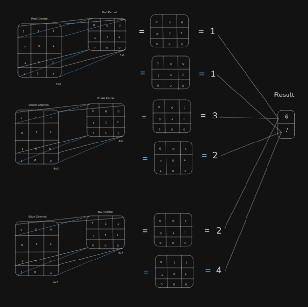
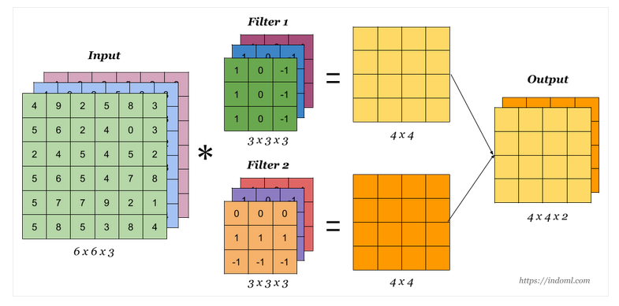
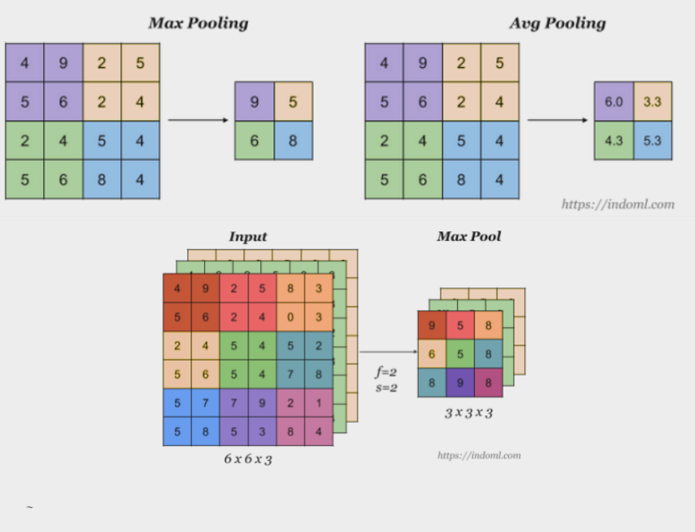
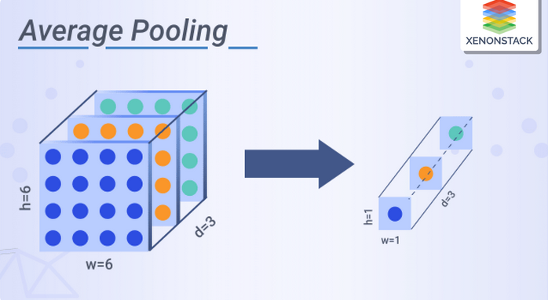

# Convolutional Neural Networks

Convolutional Neural Networks are specialized neural networks designed to process grid-like data such as images. They exploit spatial hierarchies through convolutional layers that apply filters to local patches of the input.

## Convolution Layer

The convolutional layer applies a set of learnable filters (also called kernels) to the input tensor. Each filter slides across the spatial dimensions and computes dot products between the filter and local regions of the input.

- Input channels refer to the depth of the input tensor.  
  For example:
  - A grayscale image has 1 channel.
  - An RGB image has 3 channels (Red, Green, Blue).

- Output channels are determined by the number of filters in a convolutional layer.
  - Each filter learns to detect a different feature.
  - If we use 64 filters, the output will have 64 channels.

  

### Kernel 

A kernel (or filter) is a small matrix of weights, typically of size 3×3, 5×5, etc. It has the same depth as the number of input channels.

For example, a 3×3 filter applied to a 3-channel RGB image is a tensor of shape: [3, 3, 3] height, width, channels

Each filter slides over the input and computes a weighted sum, producing a single value for each spatial location. The result is a 2D feature map.

If we use multiple filters, we get multiple feature maps stacked along the output channel dimension.

  

---

### Convolution Operation

Let $X$ be the input and $K$ be the kernel.

$$
Y(i, j) = \sum_{m} \sum_{n} X(i - m, j - n) \cdot K(m, n)
$$

- $Y(i, j)$: The output value at position (i, j)
- $X(i - m, j - n)$: The input value at an offset determined by m and n
- $K(m, n)$: The kernel value at position (m, n)
- $m, n$: Indexes that iterate over the spatial dimensions of the kernel

### Multiple Channels

With multi-channel input (e.g., RGB), each kernel has depth equal to the input channels. The full operation:

$$
Y(i, j) = \sum_{c=1}^{C} \sum_{m} \sum_{n} X_c(i - m, j - n) \cdot K_c(m, n)
$$

Where:

- $C$ = number of input channels  
- $X_c$ and $K_c$ are the input and kernel for channel $c$

Each filter combines information across all input channels and produces one output channel. Using multiple filters results in a multi-channel output.

---

### Parameters of Convolution

- Kernel size: height $\times$ width of the filter 
- Stride: how far the kernel moves each step
- Padding: number of pixels added to borders 
- Number of filters: number of output channels

---

### Output Dimensions

Given input size $I$, kernel size $K$, padding $P$, and stride $S$, the output size $O$ is:

$$
O = \left\lfloor \frac{I + 2P - K}{S} \right\rfloor + 1
$$

This is computed for both height and width separately.

## Backprop Through Convolution Layer

$$
X = \begin{bmatrix}
x_{00} & x_{01} & x_{02} \\
x_{10} & x_{11} & x_{12} \\
x_{20} & x_{21} & x_{22}
\end{bmatrix}, \quad
K = \begin{bmatrix}
w_{00} & w_{01} \\
w_{10} & w_{11}
\end{bmatrix}, \quad
grad\_output = \begin{bmatrix}
a & b \\
c & d
\end{bmatrix}, \quad
Y = \begin{bmatrix}
y_{00} & y_{01} \\
y_{10} & y_{11}
\end{bmatrix}
$$

$$
\begin{aligned}
y_{00} &= x_{00} \cdot w_{00} + x_{01} \cdot w_{01} + x_{10} \cdot w_{10} + x_{11} \cdot w_{11} \\
y_{01} &= x_{01} \cdot w_{00} + x_{02} \cdot w_{01} + x_{11} \cdot w_{10} + x_{12} \cdot w_{11} \\
y_{10} &= x_{10} \cdot w_{00} + x_{11} \cdot w_{01} + x_{20} \cdot w_{10} + x_{21} \cdot w_{11} \\
y_{11} &= x_{11} \cdot w_{00} + x_{12} \cdot w_{01} + x_{21} \cdot w_{10} + x_{22} \cdot w_{11}
\end{aligned}
$$

$$
\begin{aligned}
\frac{\partial L}{\partial w_{00}} &= a \cdot x_{00} + b \cdot x_{01} + c \cdot x_{10} + d \cdot x_{11} \\
\frac{\partial L}{\partial w_{01}} &= a \cdot x_{01} + b \cdot x_{02} + c \cdot x_{11} + d \cdot x_{12} \\
\frac{\partial L}{\partial w_{10}} &= a \cdot x_{10} + b \cdot x_{11} + c \cdot x_{20} + d \cdot x_{21} \\
\frac{\partial L}{\partial w_{11}} &= a \cdot x_{11} + b \cdot x_{12} + c \cdot x_{21} + d \cdot x_{22}
\end{aligned}
$$

$$
\begin{aligned}
\frac{\partial L}{\partial x_{00}} &= a \cdot w_{00} \\
\frac{\partial L}{\partial x_{01}} &= a \cdot w_{01} + b \cdot w_{00} \\
\frac{\partial L}{\partial x_{10}} &= a \cdot w_{10} + c \cdot w_{00} \\
\frac{\partial L}{\partial x_{11}} &= a \cdot w_{11} + b \cdot w_{10} + c \cdot w_{01} + d \cdot w_{00}
\end{aligned}
$$

## Pooling Layers

Pooling reduces the spatial dimensions (height and width) of feature maps. This helps:

- Lower computation  
- Reduce memory usage  
- Make the network more robust to small translations and distortions

  

#### Max Pooling

Selects the maximum value in each patch. Highlights the most prominent features.

#### Average Pooling

Computes the average value in each patch. Can be used for smoothing or feature preservation

#### Global Pooling (e.g., Global Average Pooling)

Instead of a fixed kernel size, global pooling reduces each channel to a single value.

$$
output\_c = \frac{1}{H \times W} \sum_{i=1}^{H} \sum_{j=1}^{W} X_c(i, j)
$$

Where $X_c$ is the feature map for channel $c$

- Often used before fully connected layers or classifiers  
- Greatly reduces the number of parameters

  

---
## Backprop Through Pooling Layer

Let the input be:

$$
X = \begin{bmatrix}
1 & 5 & 4 \\
9 & 2 & 1 \\
6 & 3 & 2 \\
\end{bmatrix}
$$

With kernel size = (2, 2)

---

### Max Pooling

The max pooling output is:

$$
Y = \begin{bmatrix}
9 & 5 \\
9 & 3 \\
\end{bmatrix}
$$

Let the gradient coming from the next layer be:

$$
grad\_output = \begin{bmatrix}
a & b \\
c & d \\
\end{bmatrix}
$$

Now, for each 2×2 window:

First window:  
  
$$
  \begin{bmatrix}
  1 & 5 \\
  9 & 2 \\
  \end{bmatrix}
  \Rightarrow \text{max} = 9 \Rightarrow \text{assign } a \text{ to position of 9}
$$

Second window:

$$
  \begin{bmatrix}
  5 & 4 \\
  2 & 1 \\
  \end{bmatrix}
  \Rightarrow \text{max} = 5 \Rightarrow \text{assign } b \text{ to position of 5}
$$

Third window:  

$$
  \begin{bmatrix}
  9 & 2 \\
  6 & 3 \\
  \end{bmatrix}
  \Rightarrow \text{max} = 9 \Rightarrow \text{assign } c \text{ to position of 9}
$$

Fourth window:

$$
  \begin{bmatrix}
  2 & 1 \\
  3 & 2 \\
  \end{bmatrix}
  \Rightarrow \text{max} = 3 \Rightarrow \text{assign } d \text{ to position of 3}
$$

So, the gradient with respect to the input becomes:

$$
\frac{\partial L}{\partial X} = \begin{bmatrix}
0 & b & 0 \\
a + c & 0 & 0 \\
0 & d & 0 \\
\end{bmatrix}
$$

### Average Pooling

Average pooling result:

$$
Y = \begin{bmatrix}
4.25 & 3 \\
5 & 2 \\
\end{bmatrix}
$$

Each 2×2 region contributes equally to the output, so gradients are evenly distributed:

Each input value gets $\frac{1}{4}$ of the gradient from the output it contributed to

$$
\frac{\partial L}{\partial X} =
\begin{bmatrix}
\frac{a}{4} & \frac{a}{4} + \frac{b}{4} & \frac{b}{4} \\
\frac{a}{4} + \frac{c}{4} & \frac{a}{4} + \frac{b}{4} + \frac{c}{4} + \frac{d}{4} & \frac{b}{4} + \frac{d}{4} \\
\frac{c}{4} & \frac{c}{4} + \frac{d}{4} & \frac{d}{4} \\
\end{bmatrix}
$$

### Resources
- https://indoml.com/2018/03/07/student-notes-convolutional-neural-networks-cnn-introduction/
- https://deeplearning.cs.cmu.edu/F21/document/recitation/Recitation5/CNN_Backprop_Recitation_5_F21.pdf
