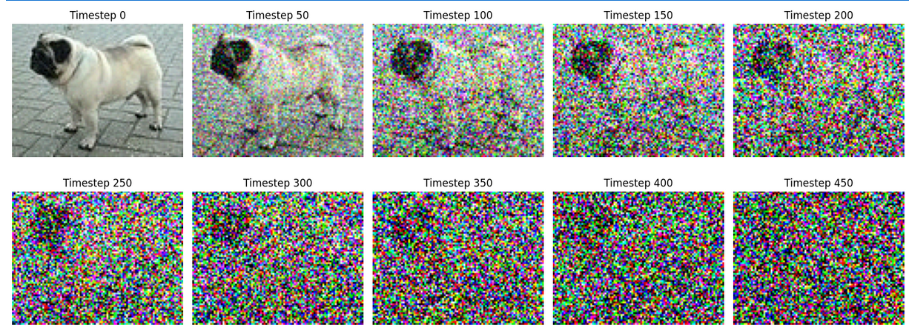
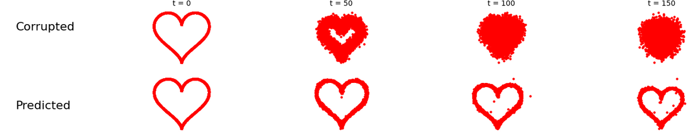
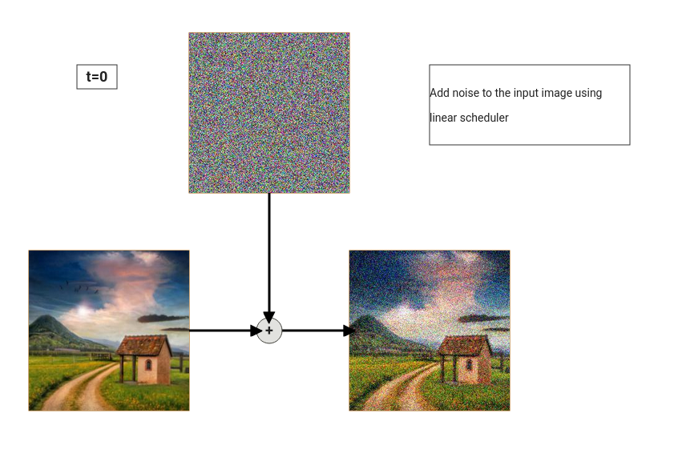
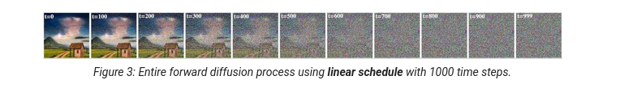
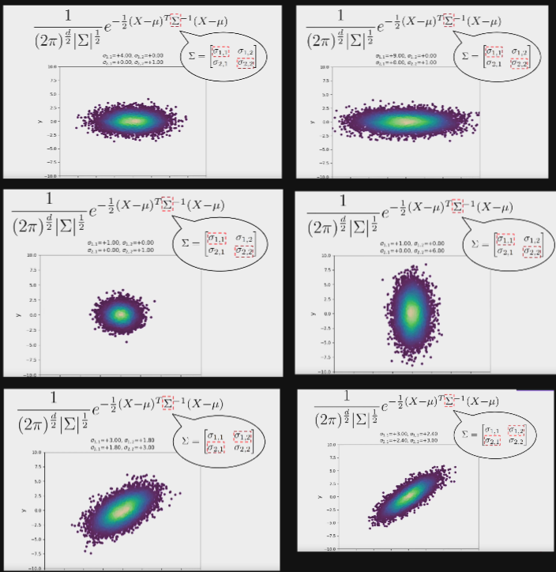

# Implementation Results

Forward pass results

  

Recover

  

# Diffisuion Models

Diffusion models are generative models that learn to reverse a gradual noising process. Imagine you start with a clean image and add random noise to it step by step, until it becomes pure noise. Now, the task is: how do you reverse that process to recover the original image?

  

  

### Forward Diffusion Process

The forward process adds noise:

$$
q(x_t | x_{t-1}) = N(x_t;\sqrt{1 - \beta_t}x_{t-1},\beta_tI)
$$

First, notation

$$
q(x_t|x_{t-1})
$$

This is the probability distribution of the next noised version $x_t$, given the previous one $x_{t-1}$. It’s a conditional distribution, because it depends on what the previous state was. This is onestep in a Markov chain.

$$
N(x_t;\mu_t;\sum_t)
$$

This says: $x_t$ is sampled from a multivariate normal (Gaussian) distribution.

That distribution has:

Mean $\mu_t = \sqrt{1-\beta_t} x_{t−1}$

Covariance $\sum_t =\beta_t I$ 

The covariance matrix $\sum$ tells us how much each component of $x$ varies and how the components of $x$ are correlated with each other.

For example

$$
\sum = 
\begin{bmatrix}
1 & 0 \\
0 & 1
\end{bmatrix}
$$

Then each dimension has variance 1 and the two dimensions are independent.

For 

$$
\sum = 
\begin{bmatrix}
1 & 0.9 \\
0.9 & 1
\end{bmatrix}
$$

The two dimensions co-vary strongly. If one increases, the other tends to increase too. The distribution would be tilted, not axis-aligned.

  

For our case, we have

$$
\sum_t =\beta_t I 
$$

So every dimension of $x_t$ has variance $\beta_t$.

All dimensions are independent.

Noise is isotropic meaning that equal in all directions.

Okay we can get back to our formula

$$
q(x_t | x_{t-1}) = N(x_t;\sqrt{1 - \beta_t}x_{t-1},\beta_tI)
$$

Where

* $x_0$ original clean image
* $x_1, x_2 ... x_t$ progressively noiser versions
* $x_t$ almost pure Gaussion noise

* $\beta_t \in (0,1)$ variance of the Gaussion noise added at step $t$

These are predefined constants called the noise schedule.

Small values (like 0.0001 to 0.02) are generaly used. If $\beta_t$ is too large, you destroy the data too quickly. Common schedules: linear \& cosine schedules.

So this formula says

Given a sample $x_{t-1}$, the next noisy version $x_t$ is normally distributed around a scaled version of $x_{t-1}$, with some Gaussian noise added.

$\sqrt{1-\beta_t} x_{t-1}$ is the mean of the Gaussian, a slightly “faded” version of $x_{t-1}$

$\beta_tI$ is the covariance matrix that adds randomness via Gaussian noise

So,

$x_t$ is a random vector centered near $\sqrt{1-\beta_t} x_t$ but with some added noise. The noise magnitude is controlled by $\beta_t$.

Our covariance matrix is diagonal so square root is

$$
\sqrt{\sum} = \sqrt{\beta_t}I 
$$

Thus,

$$
x_t = \underbrace{\sqrt{1 - \beta_t} \, x_{t-1}}_{\text{signal decayed from } x_{t-1}} + \underbrace{\sqrt{\beta_t} \, \epsilon_t}_{\epsilon_t \sim N(0, I)}
$$

We can generalize the formula using $\bar\alpha_t = \prod_{s=1}^t (1 - \beta_s)$:

$$
x_t = \sqrt{\bar\alpha_t} \, x_0 + \sqrt{1 - \bar\alpha_t} \, \epsilon
$$

The reverse process attempts to denoise $x_t$ step-by-step to recover a sample from the data distribution. The paper shows that the reverse transition is also Gaussian:

$$
q(x_{t-1} \mid x_t, x_0) = N\left(x_{t-1}; \mu_t(x_t, x_0), \tilde{\beta}_t I\right)
$$

The mean is given by:

$$
\mu_t(x_t, x_0) = \frac{\sqrt{\alpha_t}(1 - \bar{\alpha}_{t-1}) x_t + \sqrt{\bar{\alpha}_{t-1}}\beta_t x_0 }{ 1 - \bar{\alpha}_t }
$$

In practice, since $x_0$ is unknown, we approximate it using the model's predicted noise:

$$
\hat{x}_0 = \frac{1}{\sqrt{\bar{\alpha}_t}} \left(x_t - \sqrt{1 - \bar{\alpha}_t} \cdot \epsilon_\theta(x_t, t) \right)
$$

Substituting this into the formula above and simplifying yields the commonly used denoising step:

$$
x_{t-1} = \frac{1}{\sqrt{\alpha_t}} \left(x_t - \frac{\beta_t}{\sqrt{1 - \bar{\alpha}_t}} \cdot \epsilon_\theta(x_t, t) \right) + \sqrt{\beta_t} \cdot z, \quad z \sim N(0, I)
$$

This is the core sampling step used during inference.

## Example

Let:

$$
x_0 =
\begin{bmatrix}
0.2 & 0.5 \\
0.7 & 1.0
\end{bmatrix},
\quad
\epsilon_1 =
\begin{bmatrix}
-0.5 & 0.0 \\
1.0 & -1.2
\end{bmatrix},
\quad
\beta_1 = 0.2
$$

Then:

- $\sqrt{1 - \beta_1} = \sqrt{0.8} \approx 0.894$
- $\sqrt{\beta_1} = \sqrt{0.2} \approx 0.447$

#### Step 1:

$$
\sqrt{1 - \beta_1} \cdot x_0 =
\begin{bmatrix}
0.179 & 0.447 \\
0.626 & 0.894
\end{bmatrix}
$$

$$
\sqrt{\beta_1} \cdot \epsilon_1 =
\begin{bmatrix}
-0.224 & 0.000 \\
0.447 & -0.537
\end{bmatrix}
$$

$$
x_1 = \begin{bmatrix}
0.179 & 0.447 \\
0.626 & 0.894
\end{bmatrix}
+
\begin{bmatrix}
-0.224 & 0.000 \\
0.447 & -0.537
\end{bmatrix} =
\begin{bmatrix}
-0.045 & 0.447 \\
1.073 & 0.357
\end{bmatrix}
$$

So the corrupted image $x_1$ is:

$$
x_1 =
\begin{bmatrix}
-0.045 & 0.447 \\
1.073 & 0.357
\end{bmatrix}
$$

### Resources

- https://erdem.pl/2023/11/step-by-step-visual-introduction-to-diffusion-models
- https://www.youtube.com/watch?v=UVvuwv-ne1I
- https://huggingface.co/learn/diffusion-course/unit1/3
- https://github.com/tanelp/tiny-diffusion/
- https://github.com/schinger/DiffusionModel?tab=readme-ov-file
