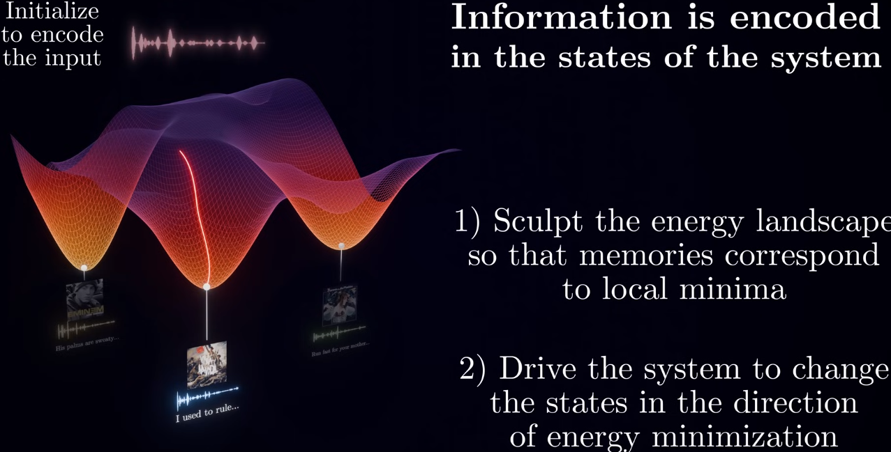
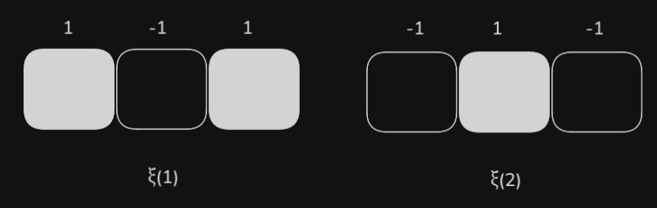
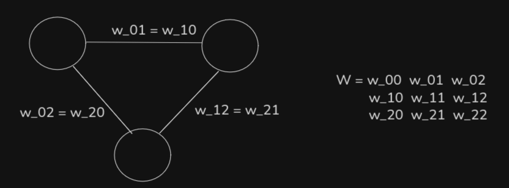
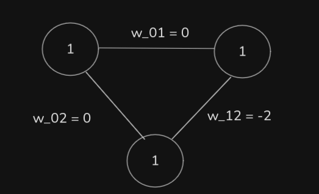

# Implementation Results

[Hopfield Networks](https://github.com/saliherdemk/Hopfield-Networks)

</img>

Unlike the example I showed in this note, I use synchronous recall in the implementation. Synchronous recall is not guaranteed like asynchronous recall, but in practice, it mostly becomes a problem with small datasets, as far as I have observed.

# Hopfield Networks

Hopfield Networks are a type of recurrent neural network designed to function as associative memory systems. They can store multiple binary patterns and, when given a noisy or incomplete input, retrieve the closest stored pattern by iteratively updating neuron states.

---

The network consists of binary neurons arranged in a fully connected structure, meaning every neuron is connected to every other neuron. Each connection between neurons $i$ and $j$ has a weight $w_{ij}$.

Hopfield Networks goal is to create an energy landscape for every record which there is a local minima for each record that we can converge in inference.

</img>

The energy function of the network is defined as:

$$
E(\mathbf{s}) = -\frac{1}{2} \sum_{i \neq j} w_{ij} s_i s_j + \sum_i \theta_i s_i
$$

where $s$ represents the binary states of all neurons $s_i \in \{-1, +1\}$, $w_{ij}$ are the weights, and $\theta_i$ are bias terms for each neuron. The reason $s_i \in \{-1, +1\}$ is that we can naturally encode alignment via $s_i s_j$.

For example
| $s_i$ | $s_j$ | $s_i s_j$ | $-w_{ij} s_i s_j$ | Energy Change (for $w_{ij} > 0$) |
|------|------|-----------|-------------------|----------------------------------|
| +1   | +1   | +1        | $-w_{ij}$         | Decreases (favorable)            |
| -1   | -1   | +1        | $-w_{ij}$         | Decreases (favorable)            |
| +1   | -1   | -1        | $+w_{ij}$         | Increases (unfavorable)          |
| -1   | +1   | -1        | $+w_{ij}$         | Increases (unfavorable)          |

So this term encourages or discourages agreement between neurons based on the sign and strength of their connection.

If two neurons are strongly positively connected, it’s "happy" when they agree.

If strongly negatively connected, it’s "happy" when they disagree.

Also, in Hopfield Network, The weights are symmetric: $w_{ij} = w_{ji}$ and there is no self connection: $w_{ij} = 0$ where $i == j$. This is because it guarentees that energy of the  network never increases during asynchronous updates.

Recall the energy function of the Hopfield Network:

$$
E(\mathbf{s}) = -\frac{1}{2} \sum_{i=1}^{N} \sum_{j=1}^{N} w_{ij} s_i s_j + \sum_{i=1}^{N} \theta_i s_i
$$

Assumptions:
- $w_{ij} = w_{ji}$ (symmetric weights)
- $w_{ii} = 0$ (no self-connections)

We want to see what happens to the energy if we change only $s_k$.

Most of the terms in the double sum are not affected by $s_k$. Only the terms that involve $s_k$ will change.

That is:
- If neither $i$ nor $j$ is $k$, then the term $w_{ij} s_i s_j$ doesn’t change.
- If either $i = k$ or $j = k$, then the term does change because $s_k$ is updated.

So let’s separate the sum based on whether $i = k$ or $j = k$.

Let’s write the energy as:

$$
E = -\frac{1}{2} \left( \sum_{\substack{i=1 \\ i \ne k}}^{N} \sum_{\substack{j=1 \\ j \ne k}}^{N} w_{ij} s_i s_j
+ 2 \sum_{j=1}^{N} w_{kj} s_k s_j \right)
+ \sum_{i=1}^{N} \theta_i s_i
$$

Here’s how we got that:

1. The first term: all the terms where neither $i$ nor $j$ is $k$ — these don’t involve $s_k$ at all and stay constant.
2. The second term: all the terms where either $i = k$ or $j = k$. Because the weights are symmetric ($w_{ij} = w_{ji}$), we combine them and write:

$$
2 \sum_{j=1}^N w_{kj} s_k s_j
$$

We double count and fix it with the factor of ½ in the energy formula.

3. Threshold term $\sum_i \theta_i s_i$ also changes only at $i = k$, so we write:

$$
\sum_i \theta_i s_i = \sum_{i \ne k} \theta_i s_i + \theta_k s_k
$$

So the total energy is:

$$
E = \underbrace{-\frac{1}{2} \sum_{\substack{i \ne k \\ j \ne k}} w_{ij} s_i s_j + \sum_{i \ne k} \theta_i s_i}_{\text{doesn't change}} 
\;\; - \sum_{j=1}^N w_{kj} s_k s_j + \theta_k s_k
$$

Let’s define the part of the energy that depends on $s_k$:

$$
E_k = - \sum_{j=1}^N w_{kj} s_k s_j + \theta_k s_k
$$

(Remember $w_{kk} = 0$, so $j = k$ doesn’t contribute anything.)

Factor out $s_k$:

$$
E_k = s_k \left( - \sum_{j=1}^N w_{kj} s_j + \theta_k \right)
= - s_k \cdot h_k
$$

Where:

$$
h_k = \sum_j w_{kj} s_j - \theta_k
$$

We split the energy into:

- A constant part (doesn’t change when $s_k$ changes)
- A variable part $E_k$ that only depends on $s_k$

Then we compute:

$$
\Delta E = E_k^{\text{new}} - E_k^{\text{old}} = - (s_k^{\text{new}} - s_k^{\text{old}}) \cdot h_k
$$

Let’s assume the neuron does update:

- Then $s_k^{\text{new}} = \text{sign}(h_k)$
- And $s_k^{\text{old}} \ne \text{sign}(h_k)$

So:

- If $h_k > 0$, then $s_k^{\text{new}} = +1$
- If $h_k < 0$, then $s_k^{\text{new}} = -1$

In both cases:

$$
s_k^{\text{new}} \cdot h_k > 0, \quad s_k^{\text{old}} \cdot h_k < 0
$$

Then the difference:

$$
(s_k^{\text{new}} - s_k^{\text{old}}) \cdot h_k > 0 \Rightarrow \Delta E < 0
$$

- If the neuron flips state, $\Delta E < 0$: energy decreases  
- If it doesn’t flip, $s_k^{\text{new}} = s_k^{\text{old}} \Rightarrow \Delta E = 0$: energy stays the same

Okay we can get back to hopfield networks.

This energy function can be thought of as the "cost" or "tension" of the current state: the network evolves by updating neurons to decrease this energy, moving downhill in the energy landscape until it reaches a local minimum - a stable pattern stored in memory.

So out goal is to store a set of binary patterns as stable states -those will correspond to the local minimas of energy functions-, such that when presented with a noisy or incomplete version of one of those patterns, the network dynamically evolves to recover the closest stored pattern.

### Example

Suppose we want to store two binary patterns:

  </img>

- ξ¹ = [+1, -1, +1]
- ξ² = [+1, +1, -1]

Each vector has 3 neurons (N = 3). Let’s compute the weight matrix using the Hebbian learning rule.

The weights are given by:

$$
W = \sum_{\mu=1}^{P} \xi^{\mu} (\xi^{\mu})^T - P \cdot I
$$

Where

- $P$ is the number of states
- $\xi^{\mu}$ is the $\mu$'th state
- $I$ is the identity matrix

$P \cdot I$ is used to get rid of self connections. 

First compute the outer products:

For $\mu = 1$:
$$
\xi^1 \cdot (\xi^1)^T =
\begin{bmatrix}
+1 \\
-1 \\
+1 \\
\end{bmatrix}
\begin{bmatrix}
+1 & -1 & +1
\end{bmatrix}
=
\begin{bmatrix}
+1 & -1 & +1 \\
-1 & +1 & -1 \\
+1 & -1 & +1 \\
\end{bmatrix}
$$

For $\mu = 2$:
$$
\xi^2 \cdot (\xi^2)^T =
\begin{bmatrix}
+1 \\
+1 \\
-1 \\
\end{bmatrix}
\begin{bmatrix}
+1 & +1 & -1
\end{bmatrix}
=
\begin{bmatrix}
+1 & +1 & -1 \\
+1 & +1 & -1 \\
-1 & -1 & +1 \\
\end{bmatrix}
$$

Here $P = 2$

$$
W = (\xi^1 (\xi^1)^T + \xi^2 (\xi^2)^T )
=
\begin{bmatrix}
2 & 0 & 0 \\
0 & 2 & -2 \\
0 & -2 & 2 \\
\end{bmatrix}
$$

Remove self connections

$$
P \cdot I = 
2 \cdot 
\begin{bmatrix}
1 & 0 & 0 \\
0 & 1 & 0 \\
0 & 0 & 1 \\
\end{bmatrix} = 
\begin{bmatrix}
2 & 0 & 0 \\
0 & 2 & 0 \\
0 & 0 & 2 \\
\end{bmatrix}
$$

$$
W^* = W - P \cdot I
$$

$$
W^* = 
\begin{bmatrix}
2 & 0 & 0 \\
0 & 2 & -2 \\
0 & -2 & 2 \\
\end{bmatrix} - 
\begin{bmatrix}
2 & 0 & 0 \\
0 & 2 & 0 \\
0 & 0 & 2 \\
\end{bmatrix} = 
\begin{bmatrix}
0 & 0 & 0 \\
0 & 0 & -2 \\
0 & -2 & 0 \\
\end{bmatrix}
$$

We can think of this weight matrix like this:

  </img>

### Recall Pattern

Start from noisy input
$$
x = [+1, +1, +1]
$$

  </img>

We update neurons one by one in order: neuron 0, neuron 1, neuron 2.

$$
x_0^{\text{new}} = \text{sign}(W_{01} x_1 + W_{02} x_2) = \text{sign}(0 \cdot (1) + 0 \cdot (1)) = \text{sign}(0) = 1
$$

$$
x_1^{\text{new}} = \text{sign}(W_{10} x_0 + W_{12} x_2) = \text{sign}(0 \cdot (1) + (-2) \cdot (1)) = \text{sign}(-2) = -1
$$

$$
x_2^{\text{new}} = \text{sign}(W_{20} x_0 + W_{21} x_1) = \text{sign}(0 \cdot (1) + (-2) \cdot (-1)) = \text{sign}(2) = 1
$$

$$
x = \begin{bmatrix}
1 & -1 & 1 \\
\end{bmatrix} = \xi^1
$$

# Resources

- https://www.youtube.com/watch?v=1WPJdAW-sFo
- https://github.com/unixpickle/weakai/tree/master/demos/hopfield
