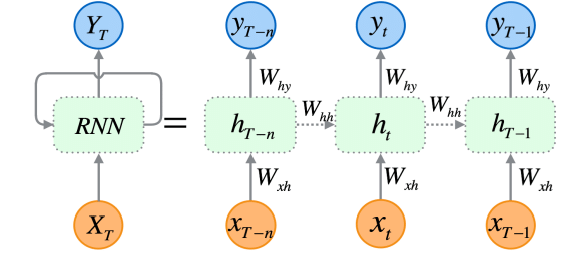
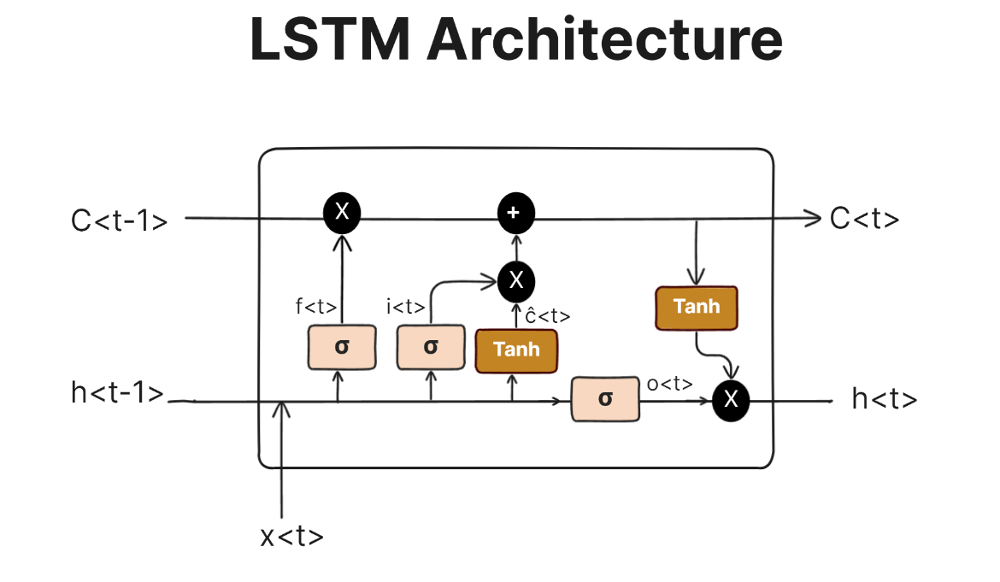
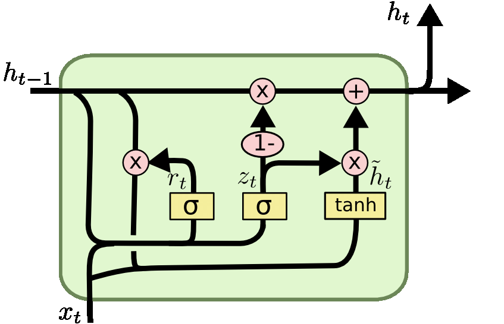

### Recurrent Neural Networks

Recurrent neural networks are networks with loops in them, allowing information to persist.


An RNN processes one element of a sequence at a time while maintaining a hidden state $h_t$ that captures information about the previous elements.

At timestep $t$:

- Input: $x_t$  
- Previous hidden state: $h_{t-1}$  
- Output: $y_t$  

The hidden state update and output are given by:

$$
h_t = \tanh(W_{hx} x_t + W_{hh} h_{t-1} + b_h)
$$

$$
y_t = W_{hy} h_t + b_y
$$

- $W_{hx}, W_{hh}, W_{hy}$: weight matrices  
- $b_h, b_y$: biases  

---


<center>
 </img>
</center>

Each timestep shares the same parameters.

### Example

```
sequences = [
    ['a', 'b', 'EOS'],
    ['a', 'a', 'b', 'b', 'EOS'],
    ['a', 'a', 'a', 'b', 'b', 'b', 'EOS'],
    ['a', 'a', 'a', 'a', 'b', 'b', 'b', 'b', 'EOS'],
    ['a', 'a', 'a', 'a', 'a', 'b', 'b', 'b', 'b', 'b', 'EOS']
]
```

Apply one hot encoding. We had `UNK` token for unknown chars. With that, our vocabulary size is 4.

```
a: [1. 0. 0. 0.]
b: [0. 1. 0. 0.]
EOS: [0. 0. 1. 0.]
UNK: [0. 0. 0. 1.]
```

### Parameter shapes

- $W_{xh}$ shape = hidden\_size, vocab\_size  
- $W_{hh}$ shape = hidden\_size, hidden\_size  
- $b_h$ shape = hidden\_size
- $W_{hy}$ shape = vocab\_size, hidden\_size  
- $b_y$ shape = vocab\_size

The forward equations:

$$
h_t = \tanh(W_{xh} \cdot x + W_{hh} \cdot h_t + b_h)
$$

$$
y_t = W_{hy} \cdot h_t + b_y
$$

At each time step, we get output $y_t$ and hidden state $h_t$.

- $h_t$ is a summary of the past, a vector that contains compressed information about everything the RNN has seen up to time step $t$.
- $y_t$, called logits, represents raw predictions before softmax. These are not probabilities yet.

Each $y_t$ (logits) has shape vocab\_size, which in our case is 4 for the characters ['a', 'b', 'EOS', 'UNK'].

---

### Example

Input character $a$:

$$
a = \begin{bmatrix} 1 \\ 0 \\ 0 \\ 0 \end{bmatrix}
$$

Model output logits $y$:

$$
y = \begin{bmatrix} 4.8925 \times 10^{-4} \\ -7.6466 \times 10^{-5} \\ -2.9858 \times 10^{-5} \\ -3.3591 \times 10^{-4} \end{bmatrix}
$$

---

Cross-entropy loss calculation for 1-character prediction


$$
\text{logits} = \begin{bmatrix} -1.2366 \times 10^{-4} & 1.7240 \times 10^{-4} \end{bmatrix}
$$


$$
\text{targets} = \begin{bmatrix} 0 \end{bmatrix}
$$


$$
logsoftmax(x_i) = x_i - \log\left( \sum_j e^{x_j} \right)
$$


$$
\sum_j e^{x_j} = e^{-1.2366 \times 10^{-4}} + e^{1.7240 \times 10^{-4}} \approx 2
$$


$$
logsoftmax(x_0) = x_0 - \log\left( \sum_j e^{x_j} \right) = -1.2366 \times 10^{-4} - \log(2) \approx -0.6933
$$


$$
\text{loss} = - logsoftmax(x_0) \approx 0.6933
$$

---

If we have more than one character, the total loss is the mean of individual losses:

$$
\text{loss} = \frac{1}{N} \sum_{i=1}^{N} \text{loss}_i
$$


---

### Backpropagation Through Time 

To train RNNs, we use Backpropagation Through Time, a variant of backpropagation applied to the unrolled RNN across multiple timesteps. The gradients are computed across the entire sequence, allowing the model to learn temporal dependencies. 

However, RNNs suffer from vanishing gradients and exploding gradients problems especially when processing long sequences.

# Long Short Term Memory

Long Short Term Memory networks are a special kind of RNN designed to overcome the vanishing and exploding gradient problems in standard RNNs. They can capture longer-term dependencies by using a more complex memory cell structure.

An LSTM maintains a cell state $c_t$ in addition to the hidden state $h_t$. The cell state acts as a kind of conveyor belt, allowing information to flow relatively unchanged, with gates controlling what is added or removed.

At each timestep $t$, the LSTM updates are:

- Input: $x_t$  
- Previous hidden state: $h_{t-1}$  
- Previous cell state: $c_{t-1}$  
- Output hidden state: $h_t$  
- Current cell state: $c_t$

---

The LSTM uses three gates and a candidate cell state:

- Forget gate $f_t$: decides what information to discard from the cell state  
- Input gate $i_t$: decides what new information to add to the cell state  
- Candidate cell state $g_t$: new candidate values to add to the cell state  
- Output gate $o_t$: decides what information to output from the hidden state


$$
i_t = \sigma(W_{ii} x_t + b_{ii} + W_{hi} h_{t-1} + b_{hi})
$$

$$
f_t = \sigma(W_{if} x_t + b_{if} + W_{hf} h_{t-1} + b_{hf})
$$

$$
g_t = \tanh(W_{ig} x_t + b_{ig} + W_{hg} h_{t-1} + b_{hg})
$$

$$
o_t = \sigma(W_{io} x_t + b_{io} + W_{ho} h_{t-1} + b_{ho})
$$

$$
c_t = f_t \odot c_{t-1} + i_t \odot g_t
$$

$$
h_t = o_t \odot \tanh(c_t)
$$

Here, $\sigma$ is the sigmoid activation function,  
$\tanh$ is the hyperbolic tangent function,  
$\odot$ denotes element-wise multiplication.  


<center>

</center>


---

### Parameter shapes

- $W_{ii}, W_{if}, W_{ig}, W_{io}$ shape: hidden\_size, embed\_dim
- $W_{hi}, W_{hf}, W_{hg}, W_{ho}$ shape: hidden\_size, hidden\_size
- $b_{ii}, b_{if}, b_{ig}, b_{io}$, $b_{hi}, b_{hf}, b_{hg}, b_{ho}$ shape: hidden\_size


# Gated Recurrent Unit

Gated Recurrent Units are a simplified variant of LSTMs that also aim to solve the vanishing gradient problem. They have fewer parameters than LSTMs and often perform comparably well on sequence tasks.

GRUs combine the cell state and hidden state into a single hidden state $h_t$, and use two gates:

- **Reset gate** $r_t$: controls how much of the previous hidden state to forget  
- **Update gate** $z_t$: controls how much of the new hidden state to blend with the old one  

At timestep $t$:

- Input: $x_t$  
- Previous hidden state: $h_{t-1}$  
- Output hidden state: $h_t$

---

The GRU equations are:

$$
r_t = \sigma(W_{ir} x_t + b_{ir} + W_{hr} h_{t-1} + b_{hr})
$$

$$
z_t = \sigma(W_{iz} x_t + b_{iz} + W_{hz} h_{t-1} + b_{hz})
$$

$$
n_t = \tanh(W_{in} x_t + b_{in} + r_t \odot (W_{hn} h_{t-1} + b_{hn}))
$$

$$
h_t = (1 - z_t) \odot n_t + z_t \odot h_{t-1}
$$

- $r_t$: reset gate  
- $z_t$: update gate  
- $n_t$: candidate hidden state  
- $h_t$: new hidden state  

Here:  
- $\sigma$ is the sigmoid activation function  
- $\tanh$ is the hyperbolic tangent  
- $\odot$ is element-wise multiplication  

---

<center>

</center>

---

### Parameter Shapes

- $W_{ir}, W_{iz}, W_{in}$: shape = hidden\_size, embed\_size  
- $W_{hr}, W_{hz}, W_{hn}$: shape = hidden\_size, hidden\_size  
- $b_{ir}, b_{hr}, b_{iz}, b_{hz}, b_{in}, b_{hn}$: shape = hidden\_size

