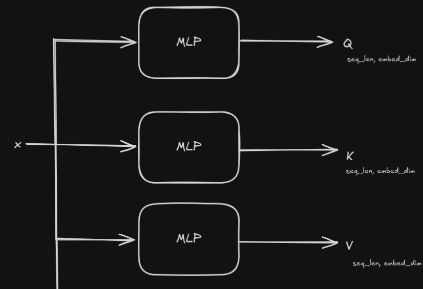

[Original Paper: Attention is All You Need](https://arxiv.org/abs/1706.03762)

# Transformer Architecture

### Example Data

| x          | y                  |
|------------|------------------|
| 1845-01-05 | January 5, 1845   |
| 1467-07-28 | July 28, 1467     |
| 1468-01-11 | January 11, 1468  |
| 1996-09-08 | September 8, 1996 |
| 1959-03-02 | March 2, 1959     |

For this problem, let's say we'll match each character with a token. With that, our vocabulary looks like this:

- 0-9 -> 10 characters
- A-Z -> 26 characters
- a-z -> 26 characters
- Special characters: `-`, `,`, space, `<sos>`, `<eos>`, `<pad>` -> 6 characters

Our vocabulary size is 68. Then we're matching each token with a single number. For example, if we match all of them with their indexes, it will look like this:

| char      | token |
|-----------|-------|
| 0-9       | 0-9   |
| A-Z       | 10-35 |
| a-z       | 36-61 |
| -         | 62    |
| ,         | 63    |
| space     | 64    |
| `<sos>`   | 65    |
| `<eos>`   | 66    |
| `<pad>`   | 67    |

Here is the tokenization process:

`1676-11-30` -> `<sos>1676-11-30<eos>` -> `[65, 1, 6, 7, 6, 62, 1, 1, 62, 3, 0, 66]`

Max input length is 10 (`1676-11-30`) + 2 (`<sos><eos>`) = 12 and max output length is 18 (`September 28, 1976`) + 2 (`<sos><eos>`) = 20. 

We're padding to achive fixed input and output length.

`November 30, 1676` -> `<sos>November 30, 1676<eos><pad>` -> `[65, 23, 50, 57, 40, 48, 37, 40, 53, 64, 3, 0, 63, 64, 1, 6, 7, 6, 66, 67]`

### Token Embeddings

For neural networks, numeric IDs alone are not enough. A single number cannot capture relationships or contextual meaning between tokens. Embeddings provide the semantic and contextual depth necessary for neural networks to generate meaningful representations and make predictions.

For a vocabulary of size 68 and an embedding dimension of 16, we are creating a 16-dimensional embedding vector for each possible character in the vocabulary. Our sampled embedding vectors for token IDs `[65, 1, 3, 66]` look like this:

|id| Dim 1   | Dim 2   | Dim 3   | Dim 4   | Dim 5   | Dim 6   | Dim 7   | Dim 8   | Dim 9   | Dim 10  | Dim 11  | Dim 12  | Dim 13  | Dim 14  | Dim 15  | Dim 16  |
|---|---------|---------|---------|---------|---------|---------|---------|---------|---------|---------|---------|---------|---------|---------|---------|---------|
|65| 0.7886  | 0.7564  | -0.7267 | 2.3488  | -1.0250 | -0.3284 | 1.0239  | -1.4597 | -1.1290 | 0.6914  | -1.4244 | -1.5344 | 1.0946  | 0.6865  | 0.4048  | -0.4310 |
|1| -1.4469 | -1.6788 | -0.2048 | 1.0333  | -0.7021 | -0.2181 | -0.4096 | 0.1382  | -0.3371 | -0.7821 | -2.2870 | -1.9544 | 0.6715  | 0.5367  | -0.3439 | -0.3719 |
|3| 0.6852  | 0.3316  | 0.7432  | -1.5985 | 1.8693  | -0.6748 | -0.0607 | -0.6371 | -0.7312 | 0.5689  | -1.1195 | 0.0210  | 0.1911  | -0.5772 | -0.4538 | 0.8649  |
|66| 1.8095  | 1.0749  | 0.7773  | -1.0318 | 0.0002  | 0.5312  | 0.4343  | 2.2210  | 0.2996  | 0.8847  | -0.4543 | 1.1797  | -0.0353 | 0.9014  | 1.2481  | -1.0354 |

These numbers are learnable parameters. During training, the model updates these embeddings to capture the relationships between tokens. For example token 1 might frequently appear after token 65 in the dataset and the embedding vectors are updated accordingly to encode this relationship.

### Positional Encoding

Unlike the sequentical models, transformers process the entire sequence in parallel. To allow the model to recognize token order we add positional encodings to token embeddings.

#### Sinusoidal Positional Encoding

For a sequence of length `L` and embedding dimension `d_model`, each position `pos` is encoded as a vector of size `d_model`:

$$
PE_{(pos,2i)} = sin(\frac{pos}{10000^{2i/d_{model}}})
$$

$$
PE_{(pos,2i + 1)} = cos(\frac{pos}{10000^{2i/d_{model}}})
$$

Where:
- `pos` = position in the sequence (0, 1, 2, …)
- `i` = dimension index (0, 1, 2, …, d_model/2 - 1)

Even dimensions use sin, odd dimensions use cos. This produces a deterministic and unique vector for each position, allowing the model to infer relative distances between tokens.

</img>

Before Positional Encoding

| Token ID | Dim 1    | Dim 2    | Dim 3    | Dim 4    | Dim 5    | Dim 6    | Dim 7    | Dim 8    | Dim 9    | Dim 10   | Dim 11   | Dim 12   | Dim 13   | Dim 14   | Dim 15   | Dim 16   |
|----------|----------|----------|----------|----------|----------|----------|----------|----------|----------|----------|----------|----------|----------|----------|----------|----------|
| 65       | -1.0169  | 3.7117   | -3.0031  | 0.0366   | -2.0964  | -4.5249  | -5.8190  | 0.1423   | 6.3528   | -5.9342  | -2.7633  | -6.5703  | -1.8161  | -1.1127  | -3.3698  | 1.6234   |
| 0        | 2.5321   | -0.1290  | -0.9900  | -3.7510  | 4.6948   | 0.8859   | -1.5571  | -2.4139  | -8.1228  | 1.2832   | -0.7425  | 1.6549   | -2.8551  | 2.4007   | 5.5863   | 6.4642   |
| 62       | -1.2332  | -1.0142  | -4.4233  | 1.6503   | 0.4995   | 2.1766   | -4.7730  | -1.4999  | 3.7029   | 0.3568   | 4.4813   | -2.4508  | -3.3141  | 8.0293   | -2.5632  | -2.9621  |
| 65       | -1.0169  | 3.7117   | -3.0031  | 0.0366   | -2.0964  | -4.5249  | -5.8190  | 0.1423   | 6.3528   | -5.9342  | -2.7633  | -6.5703  | -1.8161  | -1.1127  | -3.3698  | 1.6234   |

After Adding Positional Encoding

| Token ID | Dim 1    | Dim 2    | Dim 3    | Dim 4    | Dim 5    | Dim 6    | Dim 7    | Dim 8    | Dim 9    | Dim 10   | Dim 11   | Dim 12   | Dim 13   | Dim 14   | Dim 15   | Dim 16   |
|----------|----------|----------|----------|----------|----------|----------|----------|----------|----------|----------|----------|----------|----------|----------|----------|----------|
| 65       | -1.0169  | 4.7117   | -3.0031  | 1.0366   | -2.0964  | -3.5249  | -5.8190  | 1.1423   | 6.3528   | -4.9342  | -2.7633  | -5.5703  | -1.8161  | -0.1127  | -3.3698  | 2.6234   |
| 0        | 3.3736   | 0.4113   | -0.6790  | -2.8006  | 4.7947   | 1.8809   | -1.5255  | -1.4144  | -8.1128  | 2.2831   | -0.7393  | 2.6549   | -2.8541  | 3.4007   | 5.5866   | 7.4642   |
| 62       | -0.3239  | -1.4303  | -3.8322  | 2.4569   | 0.6982   | 3.1566   | -4.7098  | -0.5019  | 3.7229   | 1.3566   | 4.4877   | -1.4508  | -3.3121  | 9.0293   | -2.5626  | -1.9621  |
| 65       | -0.8758  | 2.7217   | -2.1904  | 0.6194   | -1.8009  | -3.5696  | -5.7243  | 1.1378   | 6.3828   | -4.9347  | -2.7538  | -5.5704  | -1.8131  | -0.1127  | -3.3689  | 2.6234   |

(All of these numbers were taken from the notebook. See `Exercises/main.ipynb`)

Notice that for token `65` and pos = 0. `dim 1` will effected by sin function because `i = 0`.

$$
PE(0,0) = sin(\frac{0}{10000^{2*0/16}}) = 0
$$

So there is no changing.

We have another `65` on pos 3. Let's calculate for `i = 0` again.

$$
PE(3,0) = sin(\frac{3}{10000^{2*0/16}}) = sin(3) = 0.1411
$$

That's why after adding pos encoding, the first dimension of token `65` will be updated to -0.8758.

$$
-1.0169 + 0.1411 = -0.8758
$$

Another way might be to set the positional embeddings as learnable. With this approach, the added values will be learned by the model.

### Attention Mechanism

The attention mechanism allows a model to focus on different parts of the input sequence when making predictions. Instead of processing information strictly left-to-right like RNNs, attention provides a way to look at all positions at once and decide which tokens are most relevant.

#### Scaled Dot-Product Attention

The inputs to attention are three matrices:

- Query (Q)
- Key (K)
- Value (V)

Each is derived from the input embeddings using learnable weight matrices.

The attention score is computed as:

$$
\text{Attention}(Q, K, V) = \text{softmax}\left(\frac{QK^\top}{\sqrt{d_k}}\right) V
$$

Where:
- $QK^\top$: similarity between queries and keys
- $d_k$: dimension of the key vectors (scaling factor)
- $V$: values, weighted according to the similarity

---

- Query asks a question: "What am I looking for?"
- Key describes information about tokens.
- Value holds the actual token information to be aggregated.
- Attention computes how much focus each query should give to each key, then uses that to weight values.

Q, K and V are mlp's which are the size of (embed_dim , embed_dim).

</img>

Given input of shape (batch_size, seq_len, embed_dim), the outputs Q, K, and V also have shape (batch_size, seq_len, embed_dim) because the MLPs have weight matrices of size (embed_dim, embed_dim).

### X

| Token | Dim 1   | Dim 2   | Dim 3   | Dim 4   | Dim 5   | Dim 6   | Dim 7   | Dim 8   | Dim 9   | Dim 10  | Dim 11  | Dim 12  | Dim 13  | Dim 14  | Dim 15  | Dim 16  |
|-------|---------|---------|---------|---------|---------|---------|---------|---------|---------|---------|---------|---------|---------|---------|---------|---------|
| 0     | -0.5219 | -3.6626 | 3.5067  | 5.9553  | -4.5138 | 9.5425  | 0.4140  | 0.0000  | 8.5562  | 0.0000  | -4.8972 | 5.2408  | 0.7016  | 4.0205  | -5.1358 | 0.3509  |
| 1     | -2.9718 | 6.6420  | -2.3001 | -1.5172 | 3.7740  | 1.8741  | -0.0000 | -5.2552 | -3.0183 | 1.5264  | 1.6031  | 1.6955  | -4.1848 | -5.1916 | 8.9527  | 7.7908  |
| 2     | -2.8965 | 5.5793  | -0.0000 | -1.6770 | 3.8838  | 1.8575  | -0.0000 | -5.2568 | -3.0072 | 0.0000  | 1.6066  | 1.6955  | -4.1837 | -5.1916 | 0.0000  | 7.7908  |
| 3     | -1.3509 | -5.9058 | -5.0286 | -0.8072 | 5.5367  | 7.7364  | -1.7266 | -3.5564 | -0.0000 | 2.1296  | -2.5950 | 2.8984  | 2.0529  | 3.2655  | -1.3962 | -2.0336 |
| 4     | -7.1883 | 0.0000  | 2.6470  | -7.2078 | 8.2077  | -1.5546 | -1.7330 | -4.8394 | -1.4136 | 1.8180  | 4.5102  | 0.0000  | -2.2874 | 1.9780  | 1.5992  | 1.6092  |
| 5     | 4.2160  | 6.0999  | 5.0990  | 7.8818  | 2.5521  | 0.0000  | -0.0000 | -5.4897 | 0.0000  | -0.1654 | -5.6621 | -1.9600 | -0.5428 | 2.1658  | 2.3610  | -3.1354 |
| 6     | -1.8182 | -3.7390 | -4.8792 | -1.8112 | 5.8357  | 7.5920  | -1.6223 | -3.5713 | -4.4001 | 2.1281  | -2.5845 | 2.8982  | 2.0562  | 3.2655  | -1.3952 | -2.0336 |
| 7     | -5.6174 | 9.0282  | 2.4768  | -8.2085 | 8.4908  | -1.7282 | -1.6292 | -4.8577 | -1.3804 | 0.0000  | 4.5208  | 0.8061  | -2.2840 | 1.9780  | 1.6003  | 1.6092  |
| 8     | 6.3808  | 5.6231  | 4.6261  | 6.9837  | 2.8165  | 8.0078  | 0.1020  | -5.5112 | 3.1477  | -0.0000 | -5.6516 | -1.9602 | -0.0000 | 2.1658  | 2.3620  | -3.1354 |
| 9     | -3.4489 | 5.0293  | -2.3220 | -3.6362 | 4.5335  | 1.4592  | -1.4338 | -5.2993 | -2.9296 | 1.5219  | 1.6312  | 1.6950  | -4.1759 | -5.1917 | 8.9555  | 7.7908  |
| 10    | 3.9414  | -2.2621 | 6.1547  | 5.6946  | 1.5500  | -2.5947 | -4.5742 | 3.4681  | -5.8263 | 1.3423  | 0.0000  | 5.4827  | 3.6104  | 6.7506  | 3.7691  | 5.4103  |
| 11    | -5.3601 | 2.7651  | -0.0137 | -3.4326 | -0.0000 | -4.8496 | 4.5023  | -1.9643 | -3.6868 | 0.0000  | -0.7003 | 6.6623  | -3.3858 | 9.9814  | -5.0630 | 2.0673  |

### Q 

| Token | Dim 1    | Dim 2    | Dim 3    | Dim 4    | Dim 5    | Dim 6    | Dim 7    | Dim 8    | Dim 9    | Dim 10   | Dim 11   | Dim 12   | Dim 13   | Dim 14   | Dim 15   | Dim 16   |
|-------|----------|----------|----------|----------|----------|----------|----------|----------|----------|----------|----------|----------|----------|----------|----------|----------|
| 0     | -5.6079  | 3.5057   | 0.9766   | -1.9639  | -1.8088  | 1.1083   | -1.5617  | 6.1078   | 1.8845   | -6.7208  | -1.7749  | -2.2501  | 0.9846   | -1.5737  | 2.5118   | 6.2278   |
| 1     | -0.7532  | -4.1501  | -2.1196  | 4.5560   | -0.0068  | -3.1668  | 1.9311   | -2.9915  | 1.4507   | 6.1199   | 3.1037   | 0.2596   | -2.8999  | -0.6691  | -1.2455  | -4.4481  |
| 2     | 0.2952   | -3.3138  | -1.7204  | 3.8956   | 0.4052   | -1.8968  | 2.6528   | -0.8761  | 1.9387   | 4.8722   | 3.0768   | -0.2745  | -2.3988  | 0.1227   | 0.5529   | -3.8664  |
| 3     | -0.9223  | 2.3391   | 0.0957   | -2.8147  | -2.9689  | -3.5583  | 1.6031   | 0.8537   | 2.4879   | -2.3032  | 0.0828   | -5.6597  | -1.1319  | -1.3399  | 0.4527   | 2.1265   |
| 4     | 2.1719   | -0.1159  | -2.4418  | 1.1033   | -2.0112  | -2.8538  | 3.2154   | -3.0942  | 1.7602   | 4.5257   | 0.9793   | -1.1368  | -2.3354  | -1.8427  | 0.4549   | -2.6866  |
| 5     | -4.0042  | 2.6543   | -4.5257  | -1.2568  | 1.8951   | 1.6418   | 0.4277   | 0.0671   | -1.6489  | -2.8243  | 1.7803   | -0.8011  | -0.6695  | -0.7361  | 1.0711   | -0.0615  |
| 6     | -0.0889  | 1.0140   | -0.0404  | -1.7653  | -2.1636  | -2.9247  | 2.0902   | -0.1786  | 1.2768   | -0.6509  | 1.1170   | -5.2709  | -1.2470  | 0.0331   | -0.1185  | 1.0878   |
| 7     | 1.0041   | -0.5055  | -4.3563  | 0.8363   | -0.8655  | -1.9176  | 2.1269   | -5.3915  | 1.3674   | 6.8530   | 3.1388   | 0.2352   | -3.1230  | 0.5476   | 0.7705   | -3.0223  |
| 8     | -5.9538  | 5.1341   | -2.9237  | -2.3325  | 0.1121   | -0.0338  | 1.2717   | 1.6770   | 0.1146   | -4.9429  | 2.0386   | -2.7226  | 0.8408   | -2.3231  | 0.7016   | 3.0024   |
| 9     | -0.0912  | -4.3904  | -1.8359  | 4.0599   | -0.0734  | -3.7463  | 2.4866   | -3.3788  | 1.5525   | 6.5187   | 2.9327   | -0.4098  | -2.3358  | -0.9555  | -1.5756  | -4.4417  |
| 10    | -2.6931  | -0.6672  | -3.0102  | 0.0902   | 4.6894   | 1.4845   | -1.0916  | -0.3620  | -1.2226  | 0.2520   | 1.4023   | 0.9981   | -1.5886  | -1.1783  | -3.6321  | -2.7833  |
| 11    | 2.2333   | -1.4239  | -3.1202  | 0.3261   | -0.5428  | 2.5348   | -2.3811  | -1.5616  | 1.2047   | 3.9039   | 1.3400   | 0.9750   | -4.3648  | 6.0287   | 3.4605   | 1.3318   |

We're just creating learnable parameters to know

- Query space (Q): what the token is searching for in other tokens.
- Key space (K): what the token contains that others might search for.
- Value space (V): the information the token actually contributes when attended to.

Then we're taking the dot product of Q with all keys K (Q @ K^T). we measure how much attention this token should pay to every other token.

Q shape: (bacth_size, seq_len, embed_dim), K^T shape: (batch_size, embed_dim, seq_len)

### Q @ K^T

| Token | 0        | 1        | 2        | 3        | 4        | 5        | 6        | 7        | 8        | 9        | 10       | 11       |
|-------|----------|----------|----------|----------|----------|----------|----------|----------|----------|----------|----------|----------|
| 0     | -5.3763  | -19.0716 | -10.7304 | 16.2014  | 25.0778  | -29.9709 | 14.1424  | 47.5504  | -3.9680  | -12.2618 | -53.3239 | -0.6131  |
| 1     | 28.7324  | -9.4999  | -6.8611  | -18.2616 | -27.7456 | -1.1073  | -23.4516 | -56.3575 | -16.1110 | -13.3637 | 59.1139  | 0.8883   |
| 2     | 33.2356  | -12.3105 | -2.6957  | -10.5091 | -21.9326 | -11.1053 | -16.4659 | -49.8313 | -20.0018 | -13.4830 | 47.4658  | -1.2959  |
| 3     | 6.2911   | -16.4541 | -5.6001  | -1.2533  | 9.2225   | 6.3236   | 4.9841   | 13.6948  | 5.7757   | -15.1106 | 23.0964  | 18.0278  |
| 4     | 0.9326   | -1.4808  | -2.6664  | -6.2392  | -4.2478  | 13.2531  | -0.6133  | -20.2357 | -6.1465  | -2.5461  | 49.7770  | 9.5165   |
| 5     | -2.5958  | -18.1085 | -16.3908 | 0.9187   | 3.2732   | 5.0221   | -10.9709 | -2.9974  | 7.5171   | -15.0100 | -29.5982 | -29.8554 |
| 6     | 16.0027  | -18.9854 | -7.9330  | -8.5611  | -2.2667  | 11.0441  | -6.8223  | -4.7966  | 8.5525   | -19.0153 | 32.5196  | 7.5894   |
| 7     | 11.6683  | 10.5559  | 3.9735   | -4.1875  | -11.2270 | 12.0608  | -6.8960  | -41.2959 | -0.8020  | 8.1903   | 44.3070  | -19.1285 |
| 8     | -1.0612  | -17.3225 | -17.5310 | 8.7398   | 22.2118  | 6.8019   | 1.0091   | 27.6504  | 18.2031  | -12.3405 | -25.6904 | -16.0338 |
| 9     | 26.6676  | -5.4987  | -4.8026  | -16.8313 | -27.4139 | 5.4588   | -19.6466 | -55.2616 | -11.5514 | -9.9637  | 67.6490  | 4.1979   |
| 10    | 5.6592   | 0.4981   | 0.8265   | 1.3560   | -6.6801  | 18.6764  | -8.1335  | -19.9559 | 8.5394   | -1.0782  | -2.8182  | -6.0825  |
| 11    | 11.7751  | 3.8447   | 12.8273  | 3.6451   | -13.5613 | -25.4471 | -6.3279  | -36.0715 | -15.5435 | 4.4850   | -15.7695 | -45.6263 |

Notice that Q @ K^T shape is (batch_size, seq_len, seq_len).

Each element (i, j) in the resulting matrix represents how much token i should attend to token j.

- Higher value → token i should pay more attention to token j.
- Lower value → token i should pay less attention to token j.

Before explaining what that means, lets apply normalization. Full formula for that operation contains $\sqrt{d_k}$. Without scaling, when $d_k$ is large, the dot products grow large in magnitude. This pushes the softmax into regions with very small gradients. Dividing by $\sqrt{d_k}$ keeps values at a manageable range. (https://www.youtube.com/watch?v=kCc8FmEb1nY&t=4615s)

After lastly we use softmax to convert raw values into probabilities.

### $\text{softmax}\left(\frac{QK^\top}{\sqrt{d_k}}\right)$

| Token | 0       | 1       | 2       | 3       | 4       | 5       | 6       | 7       | 8       | 9       | 10      | 11      |
|-------|---------|---------|---------|---------|---------|---------|---------|---------|---------|---------|---------|---------|
| 0     | 0.0000  | 0.0000  | 0.0000  | 0.0004  | 0.0036  | 0.0000  | 0.0002  | 0.9957  | 0.0000  | 0.0000  | 0.0000  | 0.0000  |
| 1     | 0.0005  | 0.0000  | 0.0000  | 0.0000  | 0.0000  | 0.0000  | 0.0000  | 0.0000  | 0.0000  | 0.0000  | 0.9995  | 0.0000  |
| 2     | 0.0277  | 0.0000  | 0.0000  | 0.0000  | 0.0000  | 0.0000  | 0.0000  | 0.0000  | 0.0000  | 0.0000  | 0.9723  | 0.0000  |
| 3     | 0.0102  | 0.0000  | 0.0005  | 0.0016  | 0.0213  | 0.0103  | 0.0074  | 0.0651  | 0.0090  | 0.0000  | 0.6824  | 0.1922  |
| 4     | 0.0000  | 0.0000  | 0.0000  | 0.0000  | 0.0000  | 0.0001  | 0.0000  | 0.0000  | 0.0000  | 0.0000  | 0.9998  | 0.0000  |
| 5     | 0.0356  | 0.0007  | 0.0011  | 0.0856  | 0.1542  | 0.2388  | 0.0044  | 0.0322  | 0.4457  | 0.0016  | 0.0000  | 0.0000  |
| 6     | 0.0157  | 0.0000  | 0.0000  | 0.0000  | 0.0002  | 0.0045  | 0.0001  | 0.0001  | 0.0024  | 0.0000  | 0.9750  | 0.0019  |
| 7     | 0.0003  | 0.0002  | 0.0000  | 0.0000  | 0.0000  | 0.0003  | 0.0000  | 0.0000  | 0.0000  | 0.0001  | 0.9990  | 0.0000  |
| 8     | 0.0006  | 0.0000  | 0.0000  | 0.0065  | 0.1878  | 0.0040  | 0.0009  | 0.7313  | 0.0689  | 0.0000  | 0.0000  | 0.0000  |
| 9     | 0.0000  | 0.0000  | 0.0000  | 0.0000  | 0.0000  | 0.0000  | 0.0000  | 0.0000  | 0.0000  | 0.0000  | 0.9999  | 0.0000  |
| 10    | 0.0330  | 0.0091  | 0.0099  | 0.0113  | 0.0015  | 0.8546  | 0.0010  | 0.0001  | 0.0678  | 0.0061  | 0.0040  | 0.0018  |
| 11    | 0.3642  | 0.0501  | 0.4737  | 0.0477  | 0.0006  | 0.0000  | 0.0039  | 0.0000  | 0.0004  | 0.0589  | 0.0004  | 0.0000  |

These are the probabilities of which token is most likely to attend to which other token. For example, if token 0 is most likely to attend to token 7 (0.9957), this means that when computing the next representation for token 0, the attention mechanism will weight the embedding of token 7 the most.

Let's say you have a sentence: “The cat sat on the mat because it was tired.” When thinking about “it”, your brain attends to “the cat” rather than “the mat,” because that’s the relevant information. That means the score will be high at row 7, col 1, because “it” attends to “cat”.

### Resources

- https://www.youtube.com/watch?v=kCc8FmEb1nY& 
- https://www.youtube.com/watch?v=T3OT8kqoqjc&
